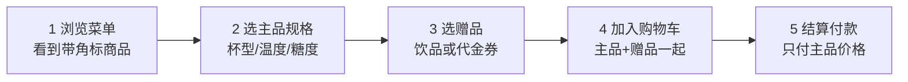
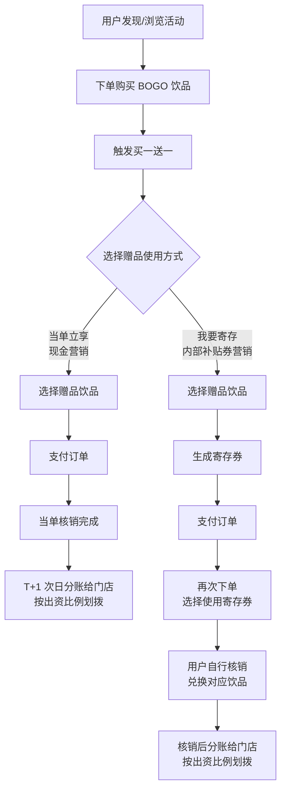
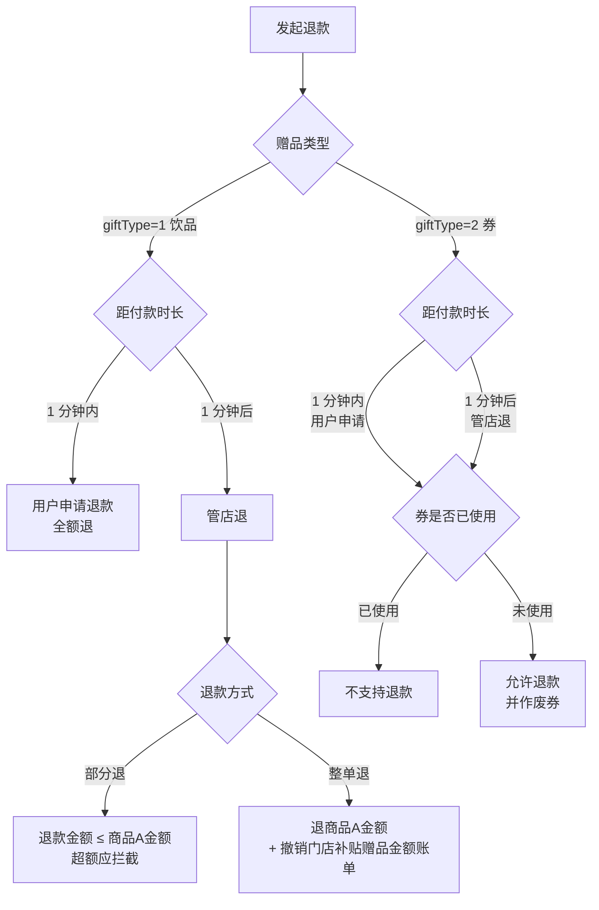
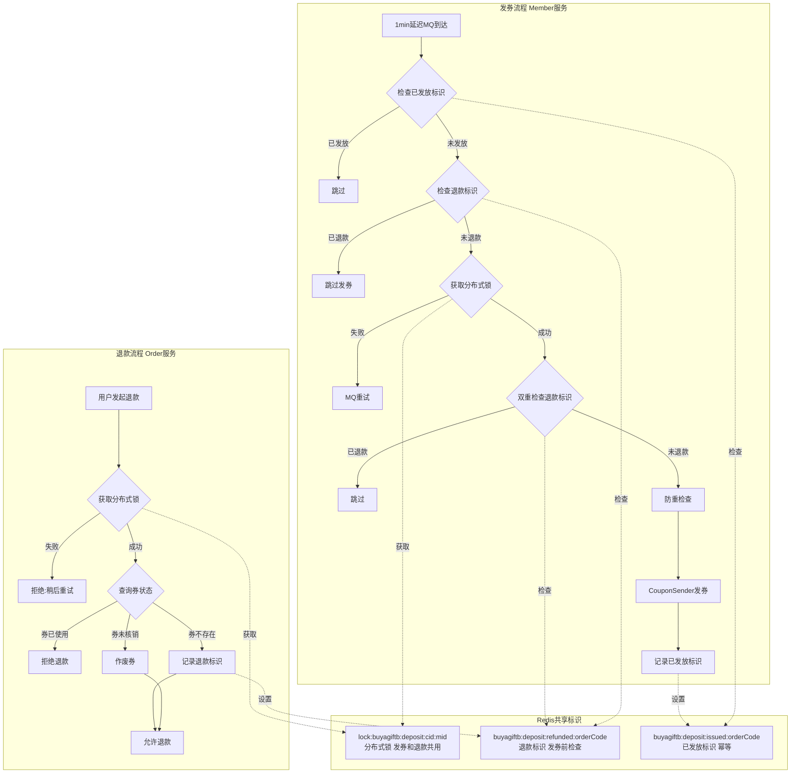
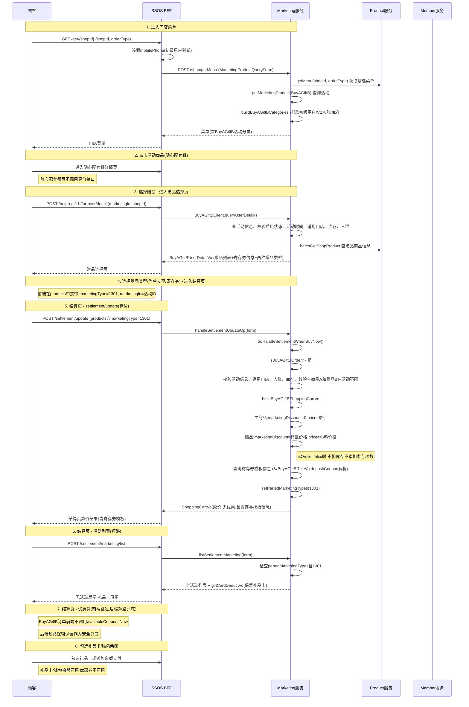

# 买A赠B 测试知识库

## 1. 业务概述

买A赠B 是营销中台的商品级赠品活动，活动类型码 `marketingType=1301`。用户购买指定的随心配套餐主商品 A，即可免费获得指定赠品 B，结算时只支付主品价格。

赠品有两种形态，由用户在赠品选择页主动二选一，无默认选中：

- `giftType=1` 当单立享 —— 赠品随单出餐，走现金营销（扫呗立减金）路径
- `giftType=2` 寄存券 —— 支付后延迟 1 分钟发券入会员卡包，后续自行核销，走内部补贴券营销路径

覆盖版本：一期（已上线）+ 二期（约束放宽型改造，主品组合放宽、赠品放开周边商品）。

---

## 2. 核心业务规则

### 2.1 活动配置规则

| 规则项 | 说明 | 测试关注点 |
|---|---|---|
| 活动主商品数量 | 只能配置 **1 个**，且必须是随心配套餐商品 | 配 2 个应被拦截；配非随心配商品应报「主品必须是随心配」 |
| 主品多组门槛 | 主商品「1 个」指配置层。该随心配套餐内部可含多组，C 端为买N赠B，用户需凑齐多组主品。匹配语义支持「一组多个」与「多个组的任一商品」 | 凑齐 `N-1` 组、同组重复选 N 件、跨组混选三种边界；`marketing_obj_rel` 按套餐内组写入多行 |
| 主品组合形态 | 1 组选 1 件、1 组选多件、多组 三种均合法 | 三种组合分别保存成功并能正常算价 |
| 定价模式 | 单选，POS 价 / 小程序专享价。主品按所选定价模式计算价格 | 两种模式下 C 端全链路价格展示与实付金额 |
| 优惠同享范围 | 买A赠B **仅可与「专享价」同享**，不与其他优惠同享 | 叠加商品券、订单券、其他活动均应被拒 |
| 赠品商品数量 | 业务上限 **30 个**（接口契约声明为 `1~100`，未按 30 收口） | 配 `1` / `30` / `31` 三档；绕过前端直调接口传 `31` 至 `100` 是否被后端拦截 |
| 赠品商品类型 | 二期允许 `productType` 取 `1`（普通商品）与 `12`（周边商品）。周边商品无杯型 | 周边赠品保存成功；`cupId` 允许空或 `0`；选择器按「全部 / 周边商品」筛选正确 |
| 赠品套餐限制 | 含 `freeGroup=1` 分组的套餐不可作为赠品 | 拦截生效；该拦截完全依赖 pc `info` 回填的 `freeGroup` 字段 |
| 寄存券张数 | 有且仅能选 **1 张** | 配 2 张应被拦截 |
| 赠品模式互斥 | 赠送商品与赠送券二选一 | 两者同时配置应被拦截 |
| 活动库存 | 取值 `1~999999`。饮品与券共享同一活动库存。**支持增加**（是否支持减少未定义） | 边界 `1` / `999999` / `1000000`；库存修改后 C 端生效 |
| 库存池归并 | 同一商品名称的多个 productId 共享 1 个活动库存，修改任一行同组联动；结算方式与排序各行独立 | 改 A 行库存，同名 B 行同步；改 A 行结算方式，B 行不变 |
| 单人参与限制 | `choiceMode` 取 `1` 不限 / `2` 活动期间 X 次 / `3` 单人单日 X 次；`limitNum` 取 `1~100` | 三种维度各自生效；`limitNum` 边界 `0` / `1` / `100` / `101` |
| 活动间隔离 | 多个买A赠B 活动之间，参与次数限制相互隔离，不互相消耗 | 用户在活动甲达上限后，活动乙仍可参与 |
| 结算方式 | `settlementType` 取 `1` 比例结算 / `2` 固定金额；支持批量设置与逐个设置，由前端处理 | 批量设置后逐个改单行，互不覆盖 |
| 补贴金额单位 | `subsidyCap` 与 `fixedAmount` 单位为**分**，补贴上限取值 `0~10000` 分 | 页面输入元、落库为分的换算精度 |
| 活动名称 | `1~30` 字符，支持中英文数字符号表情 | 边界 `0` / `1` / `30` / `31` |
| 活动说明 | `1~2000` 字符，落 `rule_desc` | 边界 `2000` / `2001` |

### 2.2 算价与同享规则

| 规则项 | 说明 | 测试关注点 |
|---|---|---|
| 独立算价链路 | 命中买A赠B 后走单独算价链路，直接购买，前端不调用 `marketing/list` 接口 | 后端短路逻辑需保留作兜底，直接调用该接口也应返回空活动列表 |
| 不享订单级活动 | 订单含买A赠B 商品时不能享受其他订单级活动 | 满减、折扣等订单级活动均不出现 |
| 不同享订单级优惠券 | 不能同享订单级优惠券 | 结算页优惠券不可用 |
| 不同享商品级优惠券 | 不能同享商品级优惠券 | 商品券不可用 |
| 不享商品级活动 | 不能享受商品级活动 | 第二杯半价等不叠加 |
| 无优惠信息 | 算价结果不返回优惠信息 | 主商品 `marketingDiscount=0`，`price` 为原价 |
| 不搭售 | 买A赠B 商品不参与搭售 | 搭售弹窗不出现 |
| 赠品价格 | 赠品 `marketingDiscount` 为杯型价格，`price` 为小料价格，实付 0 元 | 赠品行显示「¥0 ×1」 |
| 支付方式 | 可以使用礼品卡、钱包余额支付。若页面提示「门店暂不支持」，属**门店级开关**，非活动级限制 | 门店开关开启与关闭两态均需覆盖；不可只测一态 |
| 随心配套餐页 | 随心配套餐详情页**不调用算价接口** | 抓包确认无多余算价请求 |

### 2.3 下单与库存规则

| 规则项 | 说明 | 测试关注点 |
|---|---|---|
| 下单执行顺序 | `isOrder=true` 时依次：前置校验 → 扣库存 → 记录个人参与次数 → 赠品类型发放数量 +1 | 任一步失败的回滚完整性 |
| 算价不占用 | `isOrder=false` 时不扣库存、不累加参与次数 | 反复算价不消耗库存 |
| 活动信息落单 | 下单成功记录 `marketingId`、`marketingName`、`marketingType`；赠品形式记录在 `extVo` | 订单扩展字段 `buyAGiftBGiftType`、`buyAGiftBMarketingId`、`depositCouponRuleId` 落库正确 |
| 库存不足 | 扣减后不足则 INCR 回退库存，抛「活动库存不足」，下单失败 | 库存计数不为负 |
| 次数达上限 | 达上限则 INCR 回退库存，抛「已达参与上限」，下单失败 | 库存回滚、次数不变 |
| 条件失效兜底 | 下单时不再满足活动要求，后端报错弹窗；用户关闭弹窗后重新请求商品详情页，以正常模式购买商品 | 降级为普通商品可正常下单 |
| 支付超时 | 订单创建后 **10 分钟**未支付则自动取消 | 关单后库存与参与次数回滚 |
| 配置变更生效 | 活动配置缓存 5 秒生效窗口 | 窗口内旧配置仍生效 |
| 已下单订单分账 | 按下单时配置分账，不随活动后续修改变化 | 改配置后老订单分账金额不变 |

### 2.4 退款规则

以付款后 **1 分钟**为分水岭：1 分钟内为用户自助申请，1 分钟后为管店退。

| 规则项 | 说明 | 测试关注点 |
|---|---|---|
| 饮品赠品 · 1 分钟内 | 用户申请退款，**全额退** | 主品与赠品全额退回 |
| 饮品赠品 · 1 分钟后 | 管店退，支持**部分退**与**整单退** | 两种方式均需覆盖 |
| 饮品赠品 · 部分退 | 退款金额**不能大于买 A 的商品金额** | 传入超过 A 金额应被拦截；等于 A 金额应通过 |
| 饮品赠品 · 整单退 | 退商品 A 金额，且**撤销门店补贴赠品金额账单** | 扫呗撤销核销推送、`buy_a_gift_b_verify_record` 逻辑删除（`row_state=0`） |
| 券赠品 · 两个时段 | 1 分钟内与 1 分钟后判定逻辑完全相同，唯一闸门是「券是否已使用」，区别仅在发起方 | 两个时段分别验证，不可只测一个 |
| 券赠品 · 已使用 | 拒绝退款，提示「赠品券已使用，无法退款」 | 整单退被拒 |
| 券赠品 · 未使用 | 允许退款，并作废券 | 券状态变为已作废，卡包不可再核销 |
| 券赠品 · 未发放 | 券不存在时写入退款标识，允许退款，券永不发放 | 1 分钟后确认券确实未发 |
| 退款前置 | 退款前加锁校验、作废券；锁获取失败返回「系统繁忙，请稍后重试」 | 并发退款只有一笔成功 |
| 退款后置 | 回滚库存、撤销立减金 | 回滚幂等，同一订单多次触发只回滚一次 |
| 发起方 | 用户发起、mgd 发起、POS 发起走相同校验链路 | 三个入口分别验证 |

### 2.5 资金与分账规则

| 规则项 | 说明 | 测试关注点 |
|---|---|---|
| 当单立享路径 | 走现金营销，即扫呗立减金营销账单 | 支付后推送核销，退款后推送撤销核销 |
| 寄存券路径 | 走内部补贴券营销 | 券核销后才产生分账 |
| 当单立享分账节奏 | 当单核销完成后 **T+1 次日**分账给门店，按出资比例划拨 | 次日对账单出现该笔 |
| 寄存券分账节奏 | 券被核销后分账，**无固定 T+N**，取决于用户何时核销 | 跨月核销时对账单归属日期 |
| 立减金类型 | 立减金为新增类型，需兼容已有的储值免单立减金模式 | 两种立减金并存时互不干扰 |
| POS 推送文案 | 「本单立享，满A赠B补贴金额 xxx 元」 | 小票文案与金额 |
| 结算金额上限 | 结算金额不超过优惠金额，如现价 5 元、补贴 9 元时取 5 元 | 补贴大于现价的场景 |

### 2.6 展示规则

| 规则项 | 说明 | 测试关注点 |
|---|---|---|
| 菜单页入口 | 活动商品有三处视觉入口：分类角标、商品标签、划线原价 | 任一处缺失即为展示缺陷 |
| 商品标签开关 | 「是否关联商品标签」为是则展示角标，为否不展示但活动仍生效 | 关闭标签后活动仍可参与 |
| 订单详情 · 未支付 | `giftType=2` 时后端根据活动查券模板展示 | 展示券名称与模板 ID |
| 订单详情 · 已取消 | 展示逻辑同「未支付」 | — |
| 订单详情 · 已支付 | 券已发展示实际已发券（券码、状态、面额）；券未发则查券模板展示 | 卡在 1 分钟窗口内外各验一次 |
| 订单详情 · 已退款 | 展示逻辑同「已支付」 | 券已作废时应展示作废态 |
| 赠品行 · 寄存券 | 展示「赠品券」标签 + 「已寄存 · 有效期至 MM-DD」 | — |
| 赠品行 · 当单立享 | 展示完整规格摘要，无券标签、无有效期 | 两种模式区块结构相同、标签与副文案不同，需逐字段对比 |
| 多商品折叠 | 赠品多于 3 个时折叠，提供「展开全部 / 收起更多」 | 按钮文案切换 |
| OSS 列表统计 | 展示当单立享发放数量、寄存券发放数量，每小时更新一次 | 依赖定时任务，实时性不做断言 |
| 数据统计维度 | 每日 + 赠品类型维度的订单量、营业额、**客单价** | 客单价计算口径 |

---

## 3. 状态与流程

### 3.1 状态机

**活动状态（两个正交状态位，需分别覆盖）**

```text
维度A 业务状态（由时间自动推导，不可人工改）
  未开始  --(now >= startTime)-->  进行中  --(now >= endTime)-->  已结束

维度B 启用状态（人工开关）
  禁用  --/oss/buy-a-gift-b/enable-->   启用
  启用  --/oss/buy-a-gift-b/disable-->  禁用

初始态：新建 save 或复制创建后默认为禁用
```

**编辑权限矩阵**

| 字段 | 未开始 | 进行中 | 已结束 | 禁用 |
|---|---|---|---|---|
| 活动名称 / 活动头图 / 活动说明 | 可编辑 | 可编辑 | 不可 | 可编辑 |
| 活动开始时间 | 可编辑 | 不可 | 不可 | 不可 |
| 活动结束时间 | 可编辑 | 不可 | 不可 | 可编辑 |
| 活动场景（自提 / 外卖） | 可编辑 | 不可 | 不可 | 不可 |
| 活动主商品 A | 可编辑 | 不可 | 不可 | 不可 |
| 赠品商品 添加 / 删除 | 可编辑 | 不可 | 不可 | 不可 |
| 赠品商品 结算方式 | 可编辑 | 不可 | 不可 | 不可 |
| 赠品商品 排序 | 可编辑 | 不可 | 不可 | 可编辑 |
| 赠品券 添加 / 删除 | 可编辑 | 不可 | 不可 | 不可 |
| 适用 / 不适用门店 | 可编辑 | 不可 | 不可 | 可编辑 |
| 人群标签 | 可编辑 | 不可 | 不可 | 可编辑 |
| 单人参与限制 | 可编辑 | 不可 | 不可 | 可编辑 |
| 商品标签 / 标签样式 | 可编辑 | 不可 | 不可 | 可编辑 |

「未开始」列取自技术方案「全部可编辑：禁用、活动未开始」，与一期用例「不让编辑」的记录不一致，需按待确认问题核对后再定稿。

**寄存券状态流转**

| 当前态 | 触发 | 目标态 | 附带行为 |
|---|---|---|---|
| 未发放 | MQ 延迟 1 分钟到达且未退款 | 已发放 · 未核销 | 写入已发放标识 |
| 未发放 | 1 分钟内用户退款 | 永不发放 | 写入退款标识，允许退款 |
| 未发放 | 发券失败 | 未发放 | 抛异常，MQ 重试最多 16 次 |
| 已发放 · 未核销 | 用户核销 | 已核销 | 触发核销后分账 |
| 已发放 · 未核销 | 用户退款 | 已作废 | 作废券并允许退款 |
| 已核销 | 用户退款 | 已核销 | 拒绝退款，提示「赠品券已使用，无法退款」 |

**发券 Consumer 判定顺序（顺序本身即测试点）**

1. `orderExt.buyAGiftBGiftType == 2`，否则跳过
2. 查 `buyagiftb:deposit:issued:{orderCode}`，已发放则跳过
3. 查 `buyagiftb:deposit:refunded:{orderCode}`，已退款则跳过发券
4. 获取分布式锁 `lock:buyagiftb:deposit:{customerId}:{marketingId}`，失败则抛异常 MQ 重试
5. 锁内双重检查退款标识与订单退款状态
6. `hasSendCoupons(requestId)` 防重
7. 发券成功则写入已发放标识，失败则抛异常 MQ 重试

### 3.2 核心流程图

**用户购买链路主干**



**资金与分账链路**



分账节奏断言依据：

```text
饮品（当单立享） -> 次日到账（T+1）
券（我要寄存）   -> 核销后到账（无固定 T+N，取决于用户何时核销）
```

**退款判定流程**



**发券与退款并发控制**



### 3.3 主链路时序

**菜单至结算**



**下单、支付、退款全链路**

```mermaid
sequenceDiagram
    participant C as 顾客
    participant S as SSOS BFF
    participant O as Order服务
    participant M as Marketing服务
    participant MEM as Member服务
    participant MQ as RocketMQ
    participant R as Redis

    Note over C,R: ========== 下单阶段 ==========

    Note over C,M: 1. 下单(settlement/update, isOrder=true)
    C->>S: POST /settlement/update (isOrder=true, products含1301)
    S->>M: handleSettlementUpdateOp(form)
    M->>M: doHandleSettlementWhenBuyNow()
    M->>M: isBuyAGiftBOrder? - 是
    M->>M: buildBuyAGiftBShoppingCartVo
    M->>M: 校验适用门店、主商品A和赠品B在活动范围、适用人群

    Note over M,R: 库存扣减(isOrder=true)
    M->>R: DECR marketing_info:stock:{marketingId}
    alt 库存不足
        M->>R: INCR 回退库存
        M-->>S: 抛异常 活动库存不足
        S-->>C: 下单失败
    else 库存充足
        Note over M,R: 参与次数累加(isOrder=true)
        M->>R: GET part_times:{customerId}:{marketingId}
        alt 达到上限
            M->>R: INCR 回退库存
            M-->>S: 抛异常 已达参与上限
            S-->>C: 下单失败
        else 未达上限
            M->>R: INCR part_times:{customerId}:{marketingId}
            M->>M: 构建ShoppingCartVo(主商品原价+赠品杯型全免)
            M->>M: setPartedMarketingTypes(1301)
            M->>R: SAVE BuyNowPriceModel(transToken)
            M-->>S: ShoppingCartVo + transToken
            S->>O: 创单(transToken, orderExt含buyAGiftBGiftType)
            O->>O: 保存订单(含orderExt: buyAGiftBGiftType=2, buyAGiftBMarketingId, depositCouponRuleId)
            O-->>S: 订单创建成功
            S-->>C: 下单成功,等待支付
        end
    end

    Note over C,R: ========== 支付阶段 ==========

    Note over C,MEM: 2. 支付
    C->>S: 支付(支持礼品卡/钱包余额)
    S->>O: 支付回调
    O->>O: 更新订单状态 orderStatus=20(已支付)
    

    Note over O,MQ: 3. 推送订单信息到Member(触发1分钟延迟发券)
    O->>MEM: Feign: pushOrderInfo(OrderInfoForm)
    Note right of MEM: OrderInfoForm含orderExt字段
    MEM->>MEM: pushOrderInfo() 处理
    MEM->>MQ: 发送 TAG_PAY_ORDER_INFO_MX (delayLevel=5, 1分钟延迟)

    Note over C,S: 4. 订单页展示(已支付)
    C->>S: GET /cust/info/{orderCode}
    S->>O: 查询订单详情
    O-->>S: OrderInfoCustVo(含orderExt)
    S->>S: 解析orderExt buyAGiftBGiftType=2?
    alt 是寄存券订单
        S->>MEM: 查询用户券是否已发放 (listUserCouponsForShow)
        alt 券已发放
            S-->>C: 展示券信息(券码/状态/面额)
        else 券未发放(1分钟内)
            S->>M: 查询寄存券模板信息
            M-->>S: 寄存券模板信息
            S-->>C: 展示模板信息(券名称/模板ID)
        end
    else 当单立享订单
        S-->>C: 正常订单展示赠品商品
    end

    Note over C,R: ========== 退款阶段(1分钟内,券未发放) ==========

    Note over C,O: 5. 用户发起退款
    C->>S: POST /v2/order/refund
    S->>O: refund(RefundForm)
    O->>MEM: refundCheck() 退款校验

    Note over O,R: 寄存券退款检查
   MEM->>MEM: 解析orderExt buyAGiftBGiftType=2?
    MEM->>MEM: checkBuyAGiftBDepositCouponRefund

    alt 非寄存券订单
        MEM->>O: 正常退款流程
    else 是寄存券订单
        MEM->>R: 获取锁 LOCK_BUYAGIFTB_DEPOSIT +customerId+":"+marketingId
        alt 锁获取失败
            MEM-->>O: 系统繁忙,请稍后重试
            O-->>C: 退款失败,稍后重试
        else 锁获取成功
            MEM->>MEM: 查询用户寄存券状态
            alt 券存在且已使用(非未核销)
                MEM-->>O: 赠品券已使用,无法退款
                O-->>C: 退款被拒
            else 券存在且未核销
                MEM->>MEM: 作废券
                MEM-->>O: 允许退款(券已作废)
            else 券不存在(未发放)
                MEM->>R: SET BUYAGIFTB_DEPOSIT_REFUNDED +orderCode
                Note right of R: 发券Consumer将检查此标识 跳过发券
                MEM-->>O: 允许退款
            end
        end
        MEM->>R: 释放锁
    end

    Note over O: 6. 退款成功
    

    Note over C,R: ========== 1分钟延迟到达:寄存券发放 ==========

    Note over MQ,MEM: 7. MQ延迟消息触发(1分钟后)
    MQ->>MEM: DepositCouponConsumer.onMessage (TAG_PAY_ORDER_INFO_MX)

    MEM->>MEM: 解析orderExt buyAGiftBGiftType=2?

    alt 非寄存券订单
        MEM->>MEM: 跳过
    else 是寄存券订单
        MEM->>R: 检查 BUYAGIFTB_DEPOSIT_ISSUED +orderCode (幂等)
        alt 已发放(幂等)
            MEM->>MEM: 跳过
        else 未发放
            MEM->>R: 检查 BUYAGIFTB_DEPOSIT_REFUNDED +orderCode (退款标识)
            alt 已退款
                MEM->>MEM: 跳过发券, 订单已退款不发放
            else 未退款
                MEM->>R: 获取锁 LOCK_BUYAGIFTB_DEPOSIT +customerId+":"+marketingId
                alt 锁获取失败
                    MEM-->>MQ: 抛异常,MQ重试(最多16次)
                else 锁获取成功
                    MEM->>R: 双重检查退款标识、订单退款状态
                    alt 已退款
                        MEM->>MEM: 跳过发券
                    else 未退款
                        MEM->>MEM: hasSendCoupons(requestId) 防重检查
                        alt 已发过
                            MEM->>R: SET 已发放标识
                        else 未发过
                            MEM->>MEM: CouponSender.sendBatch() (本地调用,同步发券)
                            alt 发券成功
                                MEM->>R: SET BUYAGIFTB_DEPOSIT_ISSUED +orderCode
                                Note right of MEM: 寄存券发放成功
                            else 发券失败
                                MEM-->>MQ: 抛异常,MQ重试
                            end
                        end
                    end
                    MEM->>R: 释放锁
                end
            end
        end
    end

    Note over C,S: 8. 退款后订单详情
    C->>S: GET /cust/info/{orderCode}
    S->>O: 查询订单详情
    O-->>S: OrderInfoCustVo(已退款状态)
    S->>S: 解析orderExt buyAGiftBGiftType=2?
    alt 是寄存券订单
        S->>MEM: 查询用户券是否已发放
        alt 券已发放且已作废
            S-->>C: 展示已作废的券信息
        else 券未发放(退款在发券前)
            S->>M: BuyAGiftBClient.queryUserDetail()
            M-->>S: 寄存券模板信息
            S-->>C: 展示模板信息 (券不会再发放,但仍展示模板)
        end
    end
```



---

## 4. 接口契约

### 4.1 接口列表

**C 端**

| 接口名称 | 方法 | 路径 | 说明 |
|---|---|---|---|
| 门店菜单 | GET | `/get/{shopId}` | 改造，拼接活动分类与角标 |
| 门店菜单（内部） | POST | `/shop/getMenu` | 改造 |
| 商详页 | — | — | 改造，替换商品角标、返回是否可参与活动 |
| 查询活动信息 | POST | `/v2/shop/buy-a-gift-b/for-user/detail` | 新增 |
| 结算页算价 | POST | `/v3/shoppingCart/settlement/update` | 改造，新增 `buyAGiftB` 对象 |
| 结算页活动列表 | POST | `/settlement/marketing/list` | 改造，命中 1301 短路返回空列表 |
| 订单详情 | GET | `/cust/info/{orderCode}` | 改造，解析 orderExt 展示券 |
| 退款 | POST | `/v2/order/refund` | 改造，新增寄存券退款校验 |

**OSS 运营中台**

| 接口名称 | 方法 | 路径 | 说明 |
|---|---|---|---|
| 创建活动 | POST | `/oss/buy-a-gift-b/save` | 新增 |
| 更新活动 | POST | `/oss/buy-a-gift-b/update` | 新增，入参较 save 多 `marketingId` |
| 活动详情 | GET | `/oss/buy-a-gift-b/detail` | 新增，入参 `id` 必填 |
| 活动列表 | POST | `/oss/buy-a-gift-b/list` | 新增，分页 |
| 启用 | GET | `/oss/buy-a-gift-b/enable` | 新增 |
| 禁用 | GET | `/oss/buy-a-gift-b/disable` | 新增 |
| 菜单分类配置 保存 | POST | `/oss/buy-a-gift-b/category-config/save` | 新增 |
| 菜单分类配置 查询 | GET | `/oss/buy-a-gift-b/category-config/get` | 新增，无入参 |
| OSS 订单详情 | — | — | 改造，新增出参 `buyAGiftBCouponList` |
| 赠品下单数据 | — | — | 新增，出参含 `marketingId`、`statDate`、`orderAmount`、`orderTurnover`、`avgOrderPrice` |
| 对账单查询 | — | — | 新增 |
| 对账单导出 | — | — | 新增，走下载中心 `taskType=40` |

### 4.2 关键接口字段

**`/v2/shop/buy-a-gift-b/for-user/detail`**

| 方向 | 字段 | 类型 | 必填 | 取值范围 / 说明 |
|---|---|---|---|---|
| in | `marketingId` | integer | 是 | 活动ID |
| in | `shopId` | integer | 是 | 门店ID |
| in | `orderType` | string | 是 | `1` 堂食，`2` 外卖 |
| out | `marketingId` | integer | — | 活动ID |
| out | `marketingName` | string | — | 活动名称 |
| out | `giftInfo` | string | — | 赠品信息说明，含两种赠品类型 |
| out | `startTime` | string | — | `yyyy-MM-dd HH:mm:ss` |
| out | `endTime` | string | — | `yyyy-MM-dd HH:mm:ss` |
| out | `marketingImageUrl` | string | — | 活动头图 URL |
| out | `marketingDesc` | string | — | 活动说明 |
| out | `immediateGiftProducts` | `object[]` | — | 当单立享赠品商品列表 |
| out | `depositCoupon` | object | — | 寄存券配置 |

**`/v3/shoppingCart/settlement/update` 增量字段**

| 方向 | 层级 | 字段 | 类型 | 必填 | 取值 |
|---|---|---|---|---|---|
| in | 1 | `buyAGiftB` | object | 否 | 买赠活动参数 |
| in | 2 | `buyAGiftB.giftType` | integer | 是 | `1` 当单立享，`2` 寄存券 |
| in | 2 | `buyAGiftB.marketingId` | integer | 是 | 活动ID |
| out | 1 | `buyAGiftB` | object | 否 | 活动信息 |
| out | 2 | `giftType` | integer | 否 | `1` 或 `2` |
| out | 2 | `couponInfo` | object | 否 | 寄存券信息 |
| out | 3 | `couponInfo.couponRuleId` | integer | 否 | 券模板ID |
| out | 3 | `couponInfo.couponName` | string | 否 | 券名称 |

当单立享的赠品行通过商品详情中 `marketingType=1301` 识别。

**`/oss/buy-a-gift-b/save`（校验规则的唯一权威表）**

| 层 | 字段 | 类型 | 必填 | 取值范围 / 校验 |
|---|---|---|---|---|
| 1 | `marketingName` | string | 是 | `1~30` 字符，支持中英文数字符号表情 |
| 1 | `startTime` | string | 是 | 新建时须晚于当前时间 |
| 1 | `endTime` | string | 是 | 须晚于 `startTime` |
| 1 | `marketingImageUrl` | string | 否 | JPG / PNG / GIF |
| 1 | `marketingDesc` | string | 否 | `1~2000` 字符，落 `rule_desc` |
| 1 | `orderType` | string | 是 | 逗号分隔，`1` 堂食，`2` 外卖，至少 1 个 |
| 1 | `stock` | integer | 是 | `1~999999`，饮品与券共享同一活动库存 |
| 1 | `choiceMode` | integer | 是 | `1` 不限，`2` 活动期间X次，`3` 单人单日X次 |
| 1 | `limitNum` | integer | 条件必填 | `choiceMode` 为 `2` 或 `3` 时必填，`1~100` 正整数 |
| 1 | `shopRangeType` | integer | 是 | `1` 全部，`2` 按区域，`3` 按门店 |
| 1 | `regionIds` | `integer[]` | 否 | 与 `shopRangeType` 联动 |
| 1 | `shopIds` | `integer[]` | 否 | 与 `shopRangeType` 联动 |
| 1 | `excludeShopRangeType` | integer | 否 | `0` 无，`1` 部分门店 |
| 1 | `excludeShopIds` | `integer[]` | 否 | 不适用门店 |
| 1 | `userRangeType` | integer | 否 | `1` 全部，`2` 按人群，`3` 按用户分群 |
| 1 | `userGroupCodes` | string | 否 | 人群 code，逗号分隔 |
| 2 | `activityProduct` | object | 是 | 活动商品，仅 1 个 |
| 3 | `activityProduct.productId` | integer | 是 | 必须是随心配套餐商品 |
| 3 | `activityProduct.productName` | string | 否 | — |
| 3 | `immediateEnjoy.products` | `object[]` | 是 | 契约声明 `1~100`，业务上限 `30` |
| 4 | `products[].productId` | integer | 是 | 二期允许 `productType` 为 `1` 普通或 `12` 周边 |
| 4 | `products[].cupId` | integer | 否 | 周边商品无杯型，允许空或 `0` |
| 4 | `products[].price` | integer | 否 | 商品价格，POS 价 |
| 4 | `products[].settlementType` | integer | 是 | `1` 比例结算，`2` 固定金额 |
| 4 | `products[].settlementRatio` | integer | 否 | `0~100` 百分比，同一商品自动联动 |
| 4 | `products[].subsidyCap` | integer | 否 | 补贴上限，单位分，`0~10000` |
| 4 | `products[].fixedAmount` | integer | 否 | 固定结算金额，单位分 |
| 4 | `products[].sortIndex` | integer | 否 | 越小越前，默认按添加顺序 |
| 3 | `depositCoupon.coupons` | `object[]` | 是 | 仅 1 张 |
| 4 | `coupons[].id` | integer | 是 | 优惠券规则ID |
| 4 | `coupons[].num` | integer | 是 | 奖励数量 |
| 4 | `coupons[].bizType` | integer | 否 | `1` 优惠券，`2` 集采任务 |
| 4 | `coupons[].taskId` | integer | 否 | 任务ID |
| 4 | `coupons[].settlementRatio` | integer | 否 | 结算比例 |

**前端配置项（后端字段字典未列，取自用例）**

| 字段 | 取值 | 说明 |
|---|---|---|
| 定价模式 | POS 价 / 小程序专享价，单选 | 影响 C 端全链路价格展示 |
| 商品标签文案 | `0~14` 字符 | 底色默认白，字体默认红 |
| 分组名称（餐单分类） | `0~10` 字符 | — |
| 菜单栏展示排序 | `0~100` | 与预存次卡同值时次卡置顶 |
| 分组标签 | `0~14` 字符 | — |

### 4.3 错误码

**错误码待补充** —— 需求文档与技术方案均未定义 code 值，以下为用例与时序图中出现的提示语原文。

| 触发条件 | 提示语 | 业务码 |
|---|---|---|
| 活动库存不足 | 活动库存不足 | 【待补充】 |
| 参与次数达上限 | 已达参与上限 | 【待补充】 |
| 退款时锁获取失败 | 系统繁忙，请稍后重试 | 【待补充】 |
| 寄存券已核销后退款 | 赠品券已使用，无法退款 | 【待补充】 |
| 主商品信息查询失败 | 主商品信息查询失败 | 【待补充】 |
| 主品非随心配套餐 | 主品必须是随心配 | 【待补充】 |
| 赠品含 `freeGroup=1` 分组 | 含赠品分组的套餐不可作为赠品 | 【待补充】 |
| 赠品数量超上限 | 赠品数量上限 30 | 【待补充】 |
| 对账查询未填任何条件 | 需要至少一个查询条件 | 【待补充】 |
| C 端点击去选择赠品时不可参与 | 活动库存不足 / 不能参与，toast 加弹窗回菜单 | 【待补充】 |

---

## 5. 数据存储

### 5.1 核心表

**`buy_a_gift_b_verify_record` 买A赠B活动订单核销记录**

```sql
CREATE TABLE `buy_a_gift_b_verify_record`  (
  `id` bigint(20) NOT NULL,
  `order_code` varchar(64) NOT NULL COMMENT '订单编号',
  `marketing_id` bigint(20) NOT NULL COMMENT '活动ID',
  `gift_type` tinyint(4) NOT NULL COMMENT '赠品类型 1当单立享 2寄存券',
  `order_channel` tinyint(4) COMMENT '订单渠道，1APP、2小程序、3POS、4外卖',
  `shop_code` varchar(20),
  `shop_name` varchar(50),
  `order_time` datetime,
  `pay_time` datetime,
  `discount_amount` int(11) COMMENT '优惠金额 单位分',
  `subsidy_amount` int(11) COMMENT '补贴金额 单位分',
  `coupon_source_order_code` bigint(20),
  `row_state` tinyint(4) DEFAULT 1 COMMENT '行状态 1有效 0无效',
  `coupon_code` varchar(255) NOT NULL DEFAULT '' COMMENT '券编码',
  PRIMARY KEY (`id`) USING BTREE,
  INDEX `idx_qry_time`(`order_time`, `gift_type`, `order_channel`),
  INDEX `idx_qry_marketing`(`marketing_id`, `order_time`, `gift_type`, `order_channel`),
  INDEX `idx_order_code`(`order_code`)
);
```

索引测试关注点：对账查询条件含「补贴门店」，但 `shop_code` **无索引**，大数据量下列表查询与导出存在全表扫描风险，需在压量数据下验证响应时间。

**`buy_a_gift_b_stat_day` 买A赠B活动日统计**

```sql
CREATE TABLE `buy_a_gift_b_stat_day`  (
  `id` bigint(20) NOT NULL,
  `marketing_id` bigint(20) NOT NULL,
  `date` date,
  `gift_type` tinyint(4),
  `order_amount` int(11) DEFAULT 0,
  `order_turnover` bigint(20) DEFAULT 0 COMMENT '单位分',
  PRIMARY KEY (`id`),
  INDEX `idx_qry`(`marketing_id`, `date`)
);
```

**`marketing_info` 存量表变更**

```sql
ALTER TABLE `marketing_info`
ADD COLUMN `sent_info` varchar(511) NULL COMMENT '活动库存发放信息' AFTER `valid_type`;
```

该列为 DDL 改存量表，所有读 `marketing_info` 的存量营销活动接口都需回归 `SELECT *` 场景。

**大字段清单**

| 表.字段 | 类型 | 测试关注点 |
|---|---|---|
| `marketing_info.sent_info` | varchar(511) | JSON 结构，定时任务每小时覆写 |
| `marketing_info.rule_desc` | 长文本 | 活动说明最大 `2000` 字符 |
| `marketing_special_rule` | JSON | 存主品组合、多组配置、赠品清单、结算配置 |
| `buy_a_gift_b_verify_record.coupon_code` | varchar(255) | — |

**表间关系**

```text
marketing_info (活动主表, marketingType=1301)
  ├── marketing_obj_rel           活动与主商品关联，按随心配套餐内的组写入多行
  ├── marketing_special_rule      JSON：主品组合 + 赠品清单 + 结算配置 + depositCoupon
  ├── buy_a_gift_b_verify_record  按 marketing_id 关联，订单核销与分账明细
  └── buy_a_gift_b_stat_day       按 marketing_id + date 关联，日统计

buy_a_gift_b_verify_record.order_code  --> order 服务订单表（跨库，无外键）
buy_a_gift_b_verify_record.coupon_code --> member 券实例（跨库，无外键）
```

`marketing_obj_rel` 与 `marketing_special_rule` 的完整 DDL 与 JSON schema **【待补充】**，DB 层断言目前只能人工查库。

### 5.2 缓存层（Redis）

| Key 模板 | 用途 | TTL | 测试关注点 |
|---|---|---|---|
| `buyagiftb:deposit:refunded:{orderCode}` | 退款标识，发券前检查 | 5 分钟 | TTL 小于 MQ 最大重试窗口，过期后已退款订单可能被补发券 |
| `buyagiftb:deposit:issued:{orderCode}` | 发券幂等标识 | 5 分钟 | 重复投递 MQ 不得重复发券；标识过期后幂等防线失效 |
| `lock:buyagiftb:deposit:{customerId}:{marketingId}` | 发券与退款互斥锁 | 5 秒 | 发券与退款共用同一把锁，并发时只有一方成功 |
| `marketing_info:stock:{marketingId}` | 活动库存计数，DECR 扣减 INCR 回滚 | 【待补充】 | Redis 为权威计数，DB 由定时任务每小时回写；TTL 早于活动结束会导致计数丢失 |
| `part_times:{customerId}:{marketingId}` | 用户参与次数计数 | 【待补充】 | `choiceMode=3` 单人单日时 TTL 须精确到自然日 24:00，过长则跨日不清零，过短则次数重置 |
| 活动配置缓存（key 未披露） | 活动配置 | 5 秒 | 配置变更后 5 秒生效窗口内旧配置仍生效 |

**其他幂等与限流键**

| 项 | 键 / 值 | 说明 |
|---|---|---|
| 发券防重 | `hasSendCoupons(requestId)` | 锁内二次防重 |
| 算价与下单幂等 | `transToken`，对应 `BuyNowPriceModel` | 算价结果落 Redis，下单凭 token 取 |
| MQ 重试上限 | 最多 16 次 | `TAG_PAY_ORDER_INFO_MX`，`delayLevel=5` 即 1 分钟延迟 |
| 限流阈值 QPS | 【待补充】 | 技术方案容量为估算值 |

---

## 6. 测试数据构造指引

### 配方 A · 当单立享下单与分账

- 前置条件：随心配套餐商品已配置；测试门店在适用范围内；测试账号在人群范围内
- 操作步骤
  1. OSS 建活动，主品为随心配套餐 A（1 组 1 件），赠品为普通饮品 1 个，`settlementType=1`，`settlementRatio=100`，`stock=999`
  2. 调 `/oss/buy-a-gift-b/enable` 启用，等待 `startTime` 到达
  3. C 端 `GET /get/{shopId}`，确认活动分类出现
  4. `POST /v2/shop/buy-a-gift-b/for-user/detail` 取赠品列表
  5. `POST settlement/update`，`isOrder=false`，`buyAGiftB.giftType=1`，算价
  6. `POST settlement/update`，`isOrder=true`，下单并支付
- 可验证数据：`buy_a_gift_b_verify_record` 中 `gift_type=1`、`discount_amount`、`subsidy_amount`；扫呗立减金核销推送；`marketing_info:stock` 减 1

### 配方 B · 寄存券三分支退款

- 前置条件：同配方 A，赠品改配 `depositCoupon` 1 张券
- 操作步骤
  1. 下单时 `giftType=2`，完成支付
  2. 分支 1（券未发放）：支付后 60 秒内调 `/v2/order/refund`
  3. 分支 2（券已发未核销）：等待超过 60 秒后退款
  4. 分支 3（券已核销）：等待超过 60 秒并核销券后退款
- 可验证数据
  - 分支 1：`buyagiftb:deposit:refunded:{orderCode}` 已写入，退款成功，1 分钟后确认券未发放
  - 分支 2：券状态为已作废，退款成功
  - 分支 3：退款被拒，提示「赠品券已使用，无法退款」
- 提速手段：调低 MQ `delayLevel`，或直接构造 Redis 标识位

### 配方 C · 管店退的部分退与整单退

- 前置条件：已完成支付的买A赠B 订单，赠品为饮品，距付款已超过 1 分钟
- 操作步骤
  1. 管店发起部分退，退款金额小于买 A 商品金额
  2. 另一笔订单管店发起部分退，退款金额大于买 A 商品金额
  3. 第三笔订单管店发起整单退
- 可验证数据
  - 步骤 1：退款成功，退款金额正确
  - 步骤 2：被拦截
  - 步骤 3：退回商品 A 金额，门店补贴赠品金额账单被撤销，`buy_a_gift_b_verify_record.row_state` 置 `0`，库存与参与次数回滚

### 配方 D · 周边赠品六种结算模式

- 前置条件：周边商品 SKU 已建（`productType=12`，无杯型，基础价 50 元）
- 操作步骤
  1. 同一活动内配 6 个赠品行，分别设置：无补贴 / 固定 3 元 / 比例 100% 无上限 / 比例 90% 加上限 10 元（未达上限）/ 比例 90% 加上限 10 元（已达上限）/ 补贴 9 元但现价 5 元
  2. 每种模式各下单 1 笔并支付
  3. 每笔各退款 1 笔
- 可验证数据：6 笔 `subsidy_amount` 与 6 笔退款冲正金额，共 12 个断言；其中「补贴 9 元现价 5 元」应取 5 元

### 配方 E · 库存与参与次数并发

- 前置条件：活动 `stock=10`，`choiceMode=2`，`limitNum=2`
- 操作步骤
  1. 50 并发线程下单
  2. 单用户 5 并发下单
- 可验证数据：步骤 1 成功 10 笔失败 40 笔，`marketing_info:stock` 归零且不为负；步骤 2 成功 2 笔失败 3 笔，失败时库存已回滚

### 配方 F · freeGroup 白嫖拦截

- 前置条件：商品侧准备一个含 `freeGroup=1` 分组的随心配套餐
- 操作步骤
  1. OSS 尝试将该套餐配为赠品并保存
  2. 反向验证：mock pc `info` 返回 `freeGroup=0` 后再次保存
- 可验证数据：步骤 1 保存被拦截；步骤 2 拦截失效可白嫖，证明该拦截完全依赖 pc 回填字段

### 配方 G · 多组主品门槛

- 前置条件：活动主品为含多组的随心配套餐
- 操作步骤
  1. 只凑齐 `N-1` 组，尝试进入赠品选择
  2. 凑齐全部组后进入赠品选择
  3. 同组内重复选 N 件
  4. 跨组混选
  5. 凑齐后取消其中一件
- 可验证数据：步骤 1 赠品入口不可用；步骤 2 可选赠品；步骤 3 与 4 按「一组多个」与「多个组的任一商品」语义判定；步骤 5 门槛回滚，按钮文案回退

---

## 7. 关键边界与异常场景

| 分类 | 场景 | 风险等级 |
|---|---|---|
| 资损 | 6 种结算模式 × 普通赠品与周边赠品 × 下单与退款，共 24 组分账断言 | P0 |
| 资损 | 补贴金额大于商品现价时，结算金额取现价而非补贴额 | P0 |
| 资损 | 含 `freeGroup=1` 的套餐被配为赠品，导致白嫖 | P0 |
| 资损 | 部分退时门店补贴赠品金额账单未撤销，用户退款但补贴照常到账 | P0 |
| 资损 | 绕过前端直接调 `/oss/buy-a-gift-b/save` 传 `31` 至 `100` 个赠品 | P0 |
| 资损 | 买A赠B 订单叠加商品券或订单券成功，分账基数被污染 | P0 |
| 资损 | 赠品加料计费后，加料金额是否计入分账基数无定义 | P0 |
| 并发 | 活动库存并发下单不超发，计数不为负 | P0 |
| 并发 | 单用户并发下单不超过参与次数限制 | P0 |
| 并发 | 发券与退款同时触发，共用同一把锁，只有一方成功 | P0 |
| 幂等 | MQ 重复投递不重复发券 | P0 |
| 幂等 | 同一订单多次触发库存回滚，`stock` 只增加一次 | P0 |
| 幂等 | 退款后超时关单任务再次回滚库存，导致库存虚增 | P0 |
| 状态机 | 寄存券三分支退款：未发放 / 已发放未核销 / 已核销 | P0 |
| 状态机 | 支付后 1 分钟内与 1 分钟后两个时段的退款入口与判定 | P0 |
| 状态机 | 券模式两个时段判定逻辑相同，需分别覆盖不可只测一个 | P0 |
| 边界 | 部分退金额等于、小于、大于买 A 商品金额三档 | P0 |
| 边界 | 赠品数量 `1` / `30` / `31` | P1 |
| 边界 | 活动库存 `1` / `999999` / `1000000` | P1 |
| 边界 | `limitNum` 取 `0` / `1` / `100` / `101` | P1 |
| 边界 | 活动名称 `0` / `1` / `30` / `31` 字符 | P1 |
| 边界 | 活动说明 `2000` / `2001` 字符 | P1 |
| 边界 | 多组主品凑齐 `N-1` 组、同组重复选、跨组混选 | P0 |
| 超时 | 订单创建后 10 分钟未支付自动取消，库存与参与次数回滚 | P0 |
| 超时 | 在第 9 分 50 秒完成支付，与超时关单任务竞态 | P0 |
| 超时 | pc `info` 调用超时导致保存失败，提示「主商品信息查询失败」 | P1 |
| 超时 | 退款时分布式锁获取失败，提示「系统繁忙，请稍后重试」 | P1 |
| 异常 | 下单时活动禁用、过期、库存不足的拦截与回滚 | P1 |
| 异常 | 订单算价失败导致 save 失败，库存与次数均回滚 | P1 |
| 异常 | Feign 调用 order 服务超时（创单结果未知），**不回滚活动次数** | P0 |
| 异常 | 支付后 `pushOrderInfo` 失败，发券直接失败且不自动补发，走人工 | P1 |
| 异常 | 内部补贴券库存不足导致发券失败，活动库存不回滚 | P1 |
| 异常 | 下单时不再满足活动要求，弹窗后可降级为普通商品购买 | P1 |
| 兼容 | 一期存量「买1赠1」活动全链路回归 | P0 |
| 兼容 | 寄存券链路零改动回归，且不可配周边商品 | P0 |
| 兼容 | 门店礼品卡与余额开关开启、关闭两态 | P1 |
| 兼容 | 微信小程序 / 支付宝小程序 / iOS / Android 四端展示一致 | P2 |
| 兼容 | 分类排序与预存次卡同值时次卡置顶 | P2 |
| 展示 | 菜单页三处入口：分类角标、商品标签、划线原价 | P1 |
| 展示 | 两种赠品模式在订单确认页逐字段对比，而非仅断言有赠品 | P1 |
| 展示 | 赠品多于 3 个时折叠与展开 | P1 |
| 展示 | 周边赠品图片 404 兜底图 | P2 |
| 展示 | POS 小票赠品商品显示活动优惠，赠品券不显示 | P2 |
| 数据 | 全额退款与部分退款后的日统计与对账数据 | P1 |
| 数据 | 对账单按补贴门店筛选的响应时间（`shop_code` 无索引） | P1 |
| 数据 | 寄存券跨月核销时，数据页发放量与对账单补贴总额的归属差异 | P1 |

---

## 8. 风险备忘

### 8.1 待确认问题

| 问题描述 | 影响 | 紧急度 |
|---|---|---|
| 饮品部分退时，门店补贴赠品金额账单是否撤销？现有口径仅明确整单退撤销 | 若不撤销，用户退回主品款而补贴仍到账，直接资损 | P0 |
| 「1 分钟」的计时起点是支付成功还是创单成功？是否与寄存券 MQ 延迟 1 分钟同一时间基准 | 不同源则两个 1 分钟错开，边界用例无法构造 | P0 |
| 多组主品场景下，部分退上限「买 A 的商品金额」指整个随心配套餐金额还是单组金额 | 决定部分退边界断言取值 | P0 |
| 部分退与整单退后，活动库存与单人参与次数是否回滚？两种方式是否一致 | 影响库存与次数的回滚断言 | P0 |
| 买A赠B 订单实际能否叠加商品券或优惠券？真机截图与技术方案规则矛盾 | 若规则未生效，赠品成本与券成本叠加，分账基数错误 | P0 |
| 赠品选择页底部数量步进器控制的是主商品还是赠品数量？可调范围是多少 | 若可调赠品数量，则「1 份赠品」的核心约束被突破 | P0 |
| 赠品加料是否收费？加料金额是否计入分账基数与补贴金额 | 涉及实付金额、只付主品价格承诺、分账基数三处 | P0 |
| 接口 `immediateEnjoy.products` 的 `@Size` 是否已按 30 收口 | 若仍放 `100`，前端限 30 形同虚设 | P0 |
| `marketing_info:stock` 与 `part_times` 的 Redis TTL 及过期重建逻辑 | 直接决定超发资损与跨日清零正确性 | P0 |
| `refunded` 标识的 TTL 是否大于等于 MQ 最大重试窗口 | 小于则已退款订单可能被补发券，直接资损 | P0 |
| 券模式是否支持部分退？现有口径只说可以退款并作废券 | 影响券模式退款用例组的完整性 | P1 |
| 活动「未开始」状态下是否可全量编辑？技术方案与一期用例记录不一致 | 影响编辑权限矩阵一整列 | P1 |
| 门店恶意薅羊毛的防控措施是什么？补贴券核销与立减金核销两条路径未展开 | 门店侧作弊场景用例无法设计 | P1 |
| 活动库存是否支持减少？现有材料仅写「支持增加」 | 影响库存编辑用例 | P1 |
| 各服务间超时配置（ssos 到 marketing、marketing 到 pc、order 到 member、member 到扫呗、应用到 Redis） | 无法构造超时用例，无法验证降级行为 | P1 |
| 全套业务错误码枚举（code 加 message 加是否可重试） | 异常用例只能断言文案，无法断言码值 | P1 |
| `marketing_obj_rel` 与 `marketing_special_rule` 在本场景下的字段用法与 JSON schema | DB 层断言只能人工查库 | P1 |
| 性能基线与覆盖率准入：算价接口 P99、峰值 QPS、分账金额异常监控阈值 | 无质量门禁，压测无通过线 | P1 |
| 赠品类型文案不统一：全文用「当单立享」，对账单实测枚举为「当单即享」 | 影响 OSS 筛选断言与导出文件校验 | P1 |
| 赠品选择页底部按钮是「去结算」还是「加入购物车」，是否为两个入口 | 影响主链路用例的操作步骤描述 | P1 |
| 关联商品不在该门店餐单中时的处理（历史悬挂项 ORDER-07） | 用例中标记为悬挂 | P1 |

### 8.2 已知风险

- 退款标识 `buyagiftb:deposit:refunded` 的 TTL 为 5 分钟，而发券 MQ 最多重试 16 次、重试窗口可能超过 5 分钟；一旦重试跨过 5 分钟，标识已过期，会给已退款订单补发寄存券，且 `issued` 幂等标识同为 5 分钟一并失效，业务侧「券是否已使用」的闸门拦不住这条路径，因为退款在前发券在后。
- 支付超时窗口 10 分钟与发券延迟 1 分钟之间存在 9 分钟重叠区：在第 9 分 50 秒支付成功可能与超时关单竞态，形成已取消订单获得寄存券；支付后立即退款时，退款回滚库存与超时关单回滚库存可能重复执行导致库存虚增。
- 赠品规格页存在带价加料（珍珠 1 元至莓莓肉 2 元），而活动承诺为只付主品价格，三份材料对赠品加料零定义，同时影响算价链路、实付金额与分账基数。
- 寄存券分账无固定 T+N，取决于用户何时核销；对账单交易时间对赠券取的是券核销订单的创单时间，导致活动数据页的月度发放量与对账单的月度补贴总额必然对不上，跨月与活动结束后核销尤其明显。这是设计使然而非缺陷，但需在对账页面或导出文件中给出说明，否则财务会判定系统错账。
- 已退单状态下赠品券区块仍展示「已寄存 · 有效期至 MM-DD」，与退款前应作废券的规则不符，需确认是券未真实作废还是前端文案未刷新，前者为资损。
- 二期新增的「含 `freeGroup=1` 分组不可保存」拦截，完全依赖 pc `info` 接口回填的字段；该字段回填错误即拦截失效，属单点防线。
- 发布顺序约束：`msc` 必须先于 `ssos` 发布，否则会出现后台已能筛出周边商品但保存时仍被拦截的不可用窗口。
- `shop_code` 无索引，而对账单支持按补贴门店筛选与导出，大数据量下存在全表扫描风险。
- 定时任务为弱依赖，`buyAGiftBGiftSentCountSyncJob` 每小时执行、`buyAGiftBVerifyRecordDayStatJob` 每日 01:00 执行，OSS 列表库存与数据页统计均非实时，不应作为实时断言依据。
