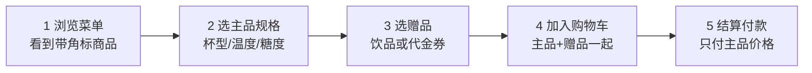
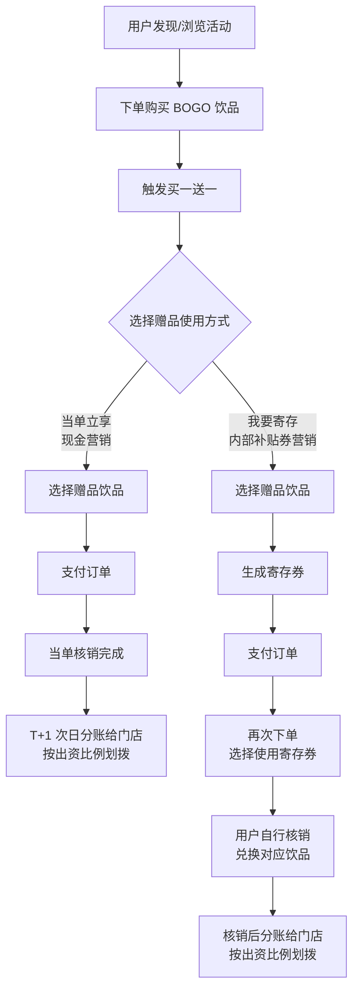
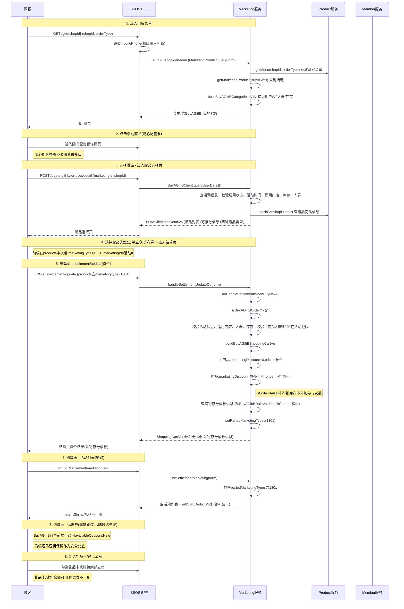
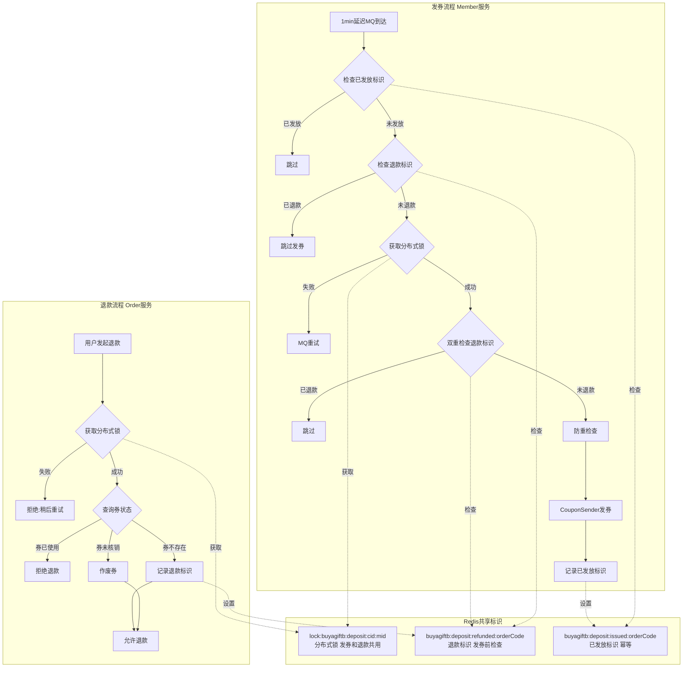
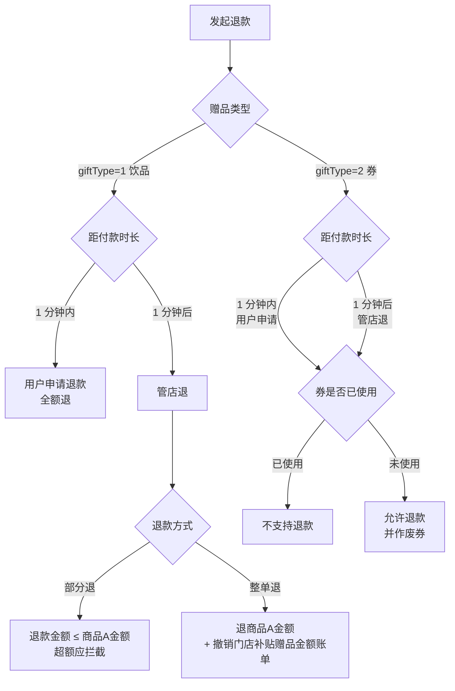

# 买A赠B 测试维度知识库 · 图像资产增补（Image Asset Extraction）

```yaml
entry_id: KB-MKT-BUYAGIFTB-001-IMG
parent_entry: KB-MKT-BUYAGIFTB-001
part: 图像资产前置处理（逻辑位置：正文 §1 之前）
extract_method: 多模态视觉抽取 + Mermaid 源码原文提取
image_total: 32
image_extracted: 15
image_skipped: 17
```

> 本部分是对已发布正文（§0 至 §9）的**图像补全**。正文此前仅基于两个 Confluence 页面的**文字层**与用例文件构建，未处理其中嵌入的 32 张图像资产。本次补全后新增 9 条口径冲突（续编 C10 起）、41 条原子化业务规则、3 个深度测试点。

---

## A. 图像资产处理台账

### A.1 抽取方式声明（重要）

两类图表的可信度**不同**，必须区分对待：

| 类别 | 数量 | 来源形态 | 抽取方式 | 可信度 |
|---|---|---|---|---|
| 文本型图表 | 3 | 技术方案页 `mermaid-macro` 宏，正文即 Mermaid 源码 | 直接读取 CDATA **原文** | **无损**，等同文字材料 |
| 位图图像 | 32 | Confluence 附件 PNG | 多模态视觉识别 | **需人工核对**，可能漏识别节点 |

⚠️ 下文 M-03 / M-04 / M-05 三张图属**第一类**，是从页面里取出的原始源码，**不是** OCR 推测结果，可直接作为权威依据；M-01 / M-02 及全部 `U-xx`、`L-01` 属第二类。

#### A.1.1 飞书渲染适配处理（规则 0.4 留痕）

飞书将 ` ```mermaid ` 代码块自动转为**画板（whiteboard）块**渲染，而非普通代码块。实测发现其解析器存在一个缺陷：

```text
在 sequenceDiagram 中使用 HTML 换行标签 会导致整张图解析失败，
服务端返回 degrade_code=2107，且图表内容被静默丢弃（标题保留、正文消失）。
同样的换行标签在 flowchart / graph 中则完全正常。
```

已逐项隔离验证：`Note over`、`alt / else / end`、花括号路径参数、圆括号均**无问题**，唯一触发项为换行标签。

**处理方式**：M-03 清洗 8 处、M-04 清洗 21 处，均替换为空格。**仅影响消息文本的折行位置，不改变任何节点、箭头与语义**；M-01 / M-02 / M-05 为 flowchart・graph 类型，换行标签保留未动。

### A.2 资产清单与处理状态

| 编号 | 来源页 | 所在章节 | 图像类型 | 处理产出 |
|---|---|---|---|---|
| IMG-P01 | PRD 120654652 | 二、用户购买链路 | 流程图 | M-01 |
| IMG-P02 | PRD 120654652 | 三、用户购买链路 | 树形结构 | L-01 |
| IMG-P03 | PRD 120654652 | 四、资金链路 | 流程图（含泳道语义） | M-02 |
| IMG-P17 | PRD 120654652 | 6 前端页面 · 第①级 | UI 原型 | U-01 |
| IMG-P20 | PRD 120654652 | 6.3 赠品选择页 | UI 原型 | U-02 |
| IMG-P21 | PRD 120654652 | 6.3 规格半屏 | UI 原型 | U-03 |
| IMG-P22 | PRD 120654652 | 7、订单确认页（寄存券） | UI 原型 | U-04a |
| IMG-P23 | PRD 120654652 | 7、订单确认页（当单立享） | UI 原型 | U-04b |
| IMG-P24 | PRD 120654652 | 7、订单已完成 | 真机截图 | U-06 |
| IMG-P25 | PRD 120654652 | 7、订单待支付 | 真机截图 | U-07 |
| IMG-P26 | PRD 120654652 | 7、订单已退单 | 真机截图 | U-08 |
| IMG-P28 | PRD 120654652 | 8、分账流程 · 对账单 | UI 原型（OSS） | U-05 |
| IMG-T01 | 技术 120655361 | 4.1 功能点 | 树形结构 | L-02 |
| IMG-T02 | 技术 120655361 | 4.1 功能点（续） | 树形结构 | L-02 |
| IMG-T03 | 技术 120655361 | 4.1 功能点（尾） | 树形结构 | L-02 |
| MMD-01 | 技术 120655361 | 4.2 菜单至结算时序 | Mermaid 源码 | M-03 |
| MMD-02 | 技术 120655361 | 4.3 下单支付退款时序 | Mermaid 源码 | M-04 |
| MMD-03 | 技术 120655361 | 4.4 发券与退款并发 | Mermaid 源码 | M-05 |

**未处理的 17 张**（PRD 正文序号 3至15、17、18、26、28）：均为 **OSS 运营中台配置页截图**（基本信息配置、活动商品、赠品模式 A/B、参与限制、活动列表、餐单分类、数据页、订单列表）与商详页杯型联动图。

跳过理由：这些页面的**字段、必填、校验规则、可编辑性**在 PRD 正文中已有完整文字表格，且已在正文 §2.3 落成 30 余字段的字段字典，图像为同源冗余。**唯一可能的遗漏是控件级交互细节与报错文案位置**，若需覆盖前端校验用例，需补充抽取，见「待澄清 Q-I」。

---

## B. 流程图转化（规则 0.2）

### M-01 用户购买链路主干（IMG-P01）



### M-02 资金与分账链路（IMG-P03）★ 正文空白项，本次补全

原图以左右分栏呈现「现金营销」与「内部补贴券营销」两条资金路径，转为带分组的流程图：



**原图右下角标注的分账节奏（测试断言依据）：**

```text
饮品（当单立享） -> 次日到账（T+1）
券（我要寄存）   -> 核销后到账（无固定 T+N，取决于用户何时核销）
```

> 这条口径决定了「寄存券活动的分账金额，永远滞后于活动下单量」，对账页的补贴金额与活动数据页的发放量**天然不等**，不是 Bug。此前正文 §7 变更影响雷达未覆盖此项。

### M-03 菜单至结算时序（MMD-01 · 源码原文）



### M-04 下单、支付、退款全链路时序（MMD-02 · 源码原文）

```mermaid
sequenceDiagram
    participant C as 顾客
    participant S as SSOS BFF
    participant O as Order服务
    participant M as Marketing服务
    participant MEM as Member服务
    participant MQ as RocketMQ
    participant R as Redis

    Note over C,R: ========== 下单阶段 ==========

    Note over C,M: 1. 下单(settlement/update, isOrder=true)
    C->>S: POST /settlement/update (isOrder=true, products含1301)
    S->>M: handleSettlementUpdateOp(form)
    M->>M: doHandleSettlementWhenBuyNow()
    M->>M: isBuyAGiftBOrder? - 是
    M->>M: buildBuyAGiftBShoppingCartVo
    M->>M: 校验适用门店、主商品A和赠品B在活动范围、适用人群

    Note over M,R: 库存扣减(isOrder=true)
    M->>R: DECR marketing_info:stock:{marketingId}
    alt 库存不足
        M->>R: INCR 回退库存
        M-->>S: 抛异常 活动库存不足
        S-->>C: 下单失败
    else 库存充足
        Note over M,R: 参与次数累加(isOrder=true)
        M->>R: GET part_times:{customerId}:{marketingId}
        alt 达到上限
            M->>R: INCR 回退库存
            M-->>S: 抛异常 已达参与上限
            S-->>C: 下单失败
        else 未达上限
            M->>R: INCR part_times:{customerId}:{marketingId}
            M->>M: 构建ShoppingCartVo(主商品原价+赠品杯型全免)
            M->>M: setPartedMarketingTypes(1301)
            M->>R: SAVE BuyNowPriceModel(transToken)
            M-->>S: ShoppingCartVo + transToken
            S->>O: 创单(transToken, orderExt含buyAGiftBGiftType)
            O->>O: 保存订单(含orderExt: buyAGiftBGiftType=2, buyAGiftBMarketingId, depositCouponRuleId)
            O-->>S: 订单创建成功
            S-->>C: 下单成功,等待支付
        end
    end

    Note over C,R: ========== 支付阶段 ==========

    Note over C,MEM: 2. 支付
    C->>S: 支付(支持礼品卡/钱包余额)
    S->>O: 支付回调
    O->>O: 更新订单状态 orderStatus=20(已支付)
    

    Note over O,MQ: 3. 推送订单信息到Member(触发1分钟延迟发券)
    O->>MEM: Feign: pushOrderInfo(OrderInfoForm)
    Note right of MEM: OrderInfoForm含orderExt字段
    MEM->>MEM: pushOrderInfo() 处理
    MEM->>MQ: 发送 TAG_PAY_ORDER_INFO_MX (delayLevel=5, 1分钟延迟)

    Note over C,S: 4. 订单页展示(已支付)
    C->>S: GET /cust/info/{orderCode}
    S->>O: 查询订单详情
    O-->>S: OrderInfoCustVo(含orderExt)
    S->>S: 解析orderExt buyAGiftBGiftType=2?
    alt 是寄存券订单
        S->>MEM: 查询用户券是否已发放 (listUserCouponsForShow)
        alt 券已发放
            S-->>C: 展示券信息(券码/状态/面额)
        else 券未发放(1分钟内)
            S->>M: 查询寄存券模板信息
            M-->>S: 寄存券模板信息
            S-->>C: 展示模板信息(券名称/模板ID)
        end
    else 当单立享订单
        S-->>C: 正常订单展示赠品商品
    end

    Note over C,R: ========== 退款阶段(1分钟内,券未发放) ==========

    Note over C,O: 5. 用户发起退款
    C->>S: POST /v2/order/refund
    S->>O: refund(RefundForm)
    O->>MEM: refundCheck() 退款校验

    Note over O,R: 寄存券退款检查
   MEM->>MEM: 解析orderExt buyAGiftBGiftType=2?
    MEM->>MEM: checkBuyAGiftBDepositCouponRefund

    alt 非寄存券订单
        MEM->>O: 正常退款流程
    else 是寄存券订单
        MEM->>R: 获取锁 LOCK_BUYAGIFTB_DEPOSIT +customerId+":"+marketingId
        alt 锁获取失败
            MEM-->>O: 系统繁忙,请稍后重试
            O-->>C: 退款失败,稍后重试
        else 锁获取成功
            MEM->>MEM: 查询用户寄存券状态
            alt 券存在且已使用(非未核销)
                MEM-->>O: 赠品券已使用,无法退款
                O-->>C: 退款被拒
            else 券存在且未核销
                MEM->>MEM: 作废券
                MEM-->>O: 允许退款(券已作废)
            else 券不存在(未发放)
                MEM->>R: SET BUYAGIFTB_DEPOSIT_REFUNDED +orderCode
                Note right of R: 发券Consumer将检查此标识 跳过发券
                MEM-->>O: 允许退款
            end
        end
        MEM->>R: 释放锁
    end

    Note over O: 6. 退款成功
    

    Note over C,R: ========== 1分钟延迟到达:寄存券发放 ==========

    Note over MQ,MEM: 7. MQ延迟消息触发(1分钟后)
    MQ->>MEM: DepositCouponConsumer.onMessage (TAG_PAY_ORDER_INFO_MX)

    MEM->>MEM: 解析orderExt buyAGiftBGiftType=2?

    alt 非寄存券订单
        MEM->>MEM: 跳过
    else 是寄存券订单
        MEM->>R: 检查 BUYAGIFTB_DEPOSIT_ISSUED +orderCode (幂等)
        alt 已发放(幂等)
            MEM->>MEM: 跳过
        else 未发放
            MEM->>R: 检查 BUYAGIFTB_DEPOSIT_REFUNDED +orderCode (退款标识)
            alt 已退款
                MEM->>MEM: 跳过发券, 订单已退款不发放
            else 未退款
                MEM->>R: 获取锁 LOCK_BUYAGIFTB_DEPOSIT +customerId+":"+marketingId
                alt 锁获取失败
                    MEM-->>MQ: 抛异常,MQ重试(最多16次)
                else 锁获取成功
                    MEM->>R: 双重检查退款标识、订单退款状态
                    alt 已退款
                        MEM->>MEM: 跳过发券
                    else 未退款
                        MEM->>MEM: hasSendCoupons(requestId) 防重检查
                        alt 已发过
                            MEM->>R: SET 已发放标识
                        else 未发过
                            MEM->>MEM: CouponSender.sendBatch() (本地调用,同步发券)
                            alt 发券成功
                                MEM->>R: SET BUYAGIFTB_DEPOSIT_ISSUED +orderCode
                                Note right of MEM: 寄存券发放成功
                            else 发券失败
                                MEM-->>MQ: 抛异常,MQ重试
                            end
                        end
                    end
                    MEM->>R: 释放锁
                end
            end
        end
    end

    Note over C,S: 8. 退款后订单详情
    C->>S: GET /cust/info/{orderCode}
    S->>O: 查询订单详情
    O-->>S: OrderInfoCustVo(已退款状态)
    S->>S: 解析orderExt buyAGiftBGiftType=2?
    alt 是寄存券订单
        S->>MEM: 查询用户券是否已发放
        alt 券已发放且已作废
            S-->>C: 展示已作废的券信息
        else 券未发放(退款在发券前)
            S->>M: BuyAGiftBClient.queryUserDetail()
            M-->>S: 寄存券模板信息
            S-->>C: 展示模板信息 (券不会再发放,但仍展示模板)
        end
    end
```



### M-05 发券与退款并发控制（MMD-03 · 源码原文）★ 深度测试点 1 的直接依据



---

## C. 树形结构转化（规则 0.2 补充 · 缩进列表）

> 飞书 Markdown 不原生支持思维导图 Block，按适配规则转为缩进列表，同时利于 RAG 分块检索。

### L-01 后台配置结构（IMG-P02 · PRD 视角）

- 后台配置
  - 活动
    - 活动名称
    - 活动时间
    - 活动规则 —— 半弹窗展示
    - 活动头图 —— 仅作展示
    - 活动商品
      - 商品 ID 下拉选择 / 搜索列表 —— 只能选择一个商品，此商品为用户需要购买的商品，在点餐页面能可能到，对应类似蜜桃四季春
      - 是否关联商品标签 —— 买一赠一的标签在活动商品创建时配置，是的话就展示标签，不是不展示
    - 活动赠品（赠送商品 / 赠券，二选一）
      - 赠送商品 —— 最多选 30 个商品；每个商品要配置赠品商品成本承担比例，包含结算比例以及固定金额比例
      - 赠送券 —— 内部补贴券
      - 赠品库存
    - 适用门店 / 不适用门店
    - 适用人群 —— 选人群标签
    - 赠品活动单人参与限制 —— 维度：单人单日 X 次 / 不限制 / 活动期间 X 次

### L-02 技术方案功能点全景（IMG-T01 至 T03 · 研发视角）★ 信息密度最高

- 活动配置
  - 创建
    - 基本信息 —— 活动名称、活动开始结束时间、活动头图、活动说明、适用场景、活动商品、**定价模式**
      - 关联商品标签
      - 活动商品 —— 随心配商品；**一个**
    - 赠品信息
      - 赠品模式：寄存券 —— 券权益
      - 赠品模式：当单立享 —— 赠品商品；设置结算方式（批量设置 / 逐个设置，**前端处理**）
      - 活动库存 —— **支持增加**
    - 适用范围 —— 门店；人群（人群标签，非必填）
    - 参与限制 —— 不限制 / 单人单日 / 活动期间 / **多个活动之间限制隔离**
  - 编辑
    - 全部可编辑 —— 禁用、**活动未开始**
    - 部分可编辑 —— 活动头图、活动说明
    - 不可编辑 —— 活动已结束
  - 详情
  - 启用 / 禁用
  - 列表 —— 当单立享发放数量、寄存券发放数量、活动状态：**未开始、进行中、已结束**
- 菜单
  - 业务配置随心配套餐
  - 查询菜单时根据活动拼接菜单 —— 商品分类、商品分类角标、活动商品价格、活动商品角标
- 商详页
  - 后端返回是否可参加活动信息
  - 商品标签 / 商品价格
  - 菜单分类交表、商品角标、规格角标 —— 走配置
  - 选择赠品页 —— 查询活动信息（赠品模式；赠品信息：商品列表 / 券信息）
  - **若不满足活动要求了** —— 后端报错弹窗，用户关闭弹窗后，重新请求商品详情页，以正常模式购买商品
- **如何避免被门店恶意薅羊毛？**（原图标红，为开放议题）
  - 补贴券核销
  - 立减金核销
- 算价
  - 单独链路，直接购买
  - 不能享受其他订单级活动
  - 不能同享订单级优惠券
  - 不能同享商品级优惠券
  - 不能享受商品级活动
  - 无优惠信息
  - 不搭售
  - 可以使用礼品卡、钱包余额支付
  - 前端不调用 `marketing/list` 接口
- 下单
  - 记录参与了买A赠B活动 —— `marketingId`、`marketingName`、`marketingType`
  - 记录选择的赠品形式 —— 记录在 `extVo` 中
  - 是否记录优惠的金额
  - 前置校验、扣库存、记录个人参与次数、赠品类型发放数量 +1
- 订单详情
  - 未支付 —— 寄存券：后端根据活动查券模板
  - 已取消 —— 同未支付
  - 已支付 —— 券已发：展示实际已发券；券还没发：后端根据活动查券模板
  - 已退款 —— 同已支付
- 退款
  - 用户发起；mgd 发起、POS 发起 —— **若券已用，拒绝整单退**
  - 退款前：加锁 L 校验、作废券
  - 退款后：**回滚库存、撤销立减金**
- 发券
  - 加锁 L；校验订单是否已退款
- 立减金推送扫呗
  - 支付后，推送核销
  - 退款后，推送撤销核销
  - 兼容已有的储值免单的立减金模式 —— **新增类型**
- 订单推送 POS —— 文案「本单立享，满A赠B补贴金额 xxx 元」
- OSS 数据统计 —— 每日 + 赠品类型：订单量、营业额、**客单价**；日期筛选
- OSS 对账单 —— 筛选、列表查询、导出
- OSS 订单 —— 订单详情展示活动信息；筛选活动的订单；筛选具体赠品类型的订单

> ⚠️ IMG-T01 与 IMG-T02 为同一张脑图的两段截图，衔接处（商详页「选择赠品页」分支之后、「如何避免被门店恶意薅羊毛」之前）**可能存在未截入的节点**，需对照原图确认。

---

## D. UI 原型元素抽取（规则 0.3）

> 用途：补充正文 §2 接口契约字典缺失的**前端展示字段与校验/提示文案**。

### U-01 第①级 · 点餐页（IMG-P17）

- 页面元素：门店信息栏 —— 门店名 + 编号（如「轻工职业学院店-No.953630」）+ 直线距离
- 页面元素：左侧分类导航 —— 分类名上方挂**红色角标「买一送一」**（对应配置项「是否关联商品标签」）
- 页面元素：商品卡片 —— 商品图、商品名、**活动标签「买一送一可寄存」（红底）**、副标题「2杯冰鲜柠檬水 + 1份冰淇淋」
- 页面元素：价格区 —— 现价「¥12 起」+ **划线原价「¥17」**
- 页面元素：右下角「+」加购按钮
- 页面元素：顶部营销 Tab —— 经典菜单 / 积分秒免单 / 杯杯减1元 / 咖啡轻乳

> 校验含义：活动商品在菜单页有**三处**视觉入口（分类角标、商品标签、划线价），任一处缺失即为展示缺陷。正文 §2.1 的 `/shop/getMenu` 仅描述了「含 BuyAGiftB 活动分类」，未约定角标与划线价，属契约缺口。

### U-02 第③级 · 赠品选择页（IMG-P20）★ 核心交互页

- 页面元素：顶部说明条 —— 「即送饮品1杯」+ 右上「活动规则」入口按钮
- 页面元素：分区①「第1件商品」—— 商品图、商品名、规格摘要「正常冰 / 七分糖 / 大杯」、价格「¥12」、**「改规格 →」按钮**
- 页面元素：分区②「第2件商品 · 赠品」—— 两张互斥卡片
  - 卡片 A「当单立享」副文案「多款指定饮品任选1件，随单出餐」；选中态为红色边框 + 右上角对勾
  - 卡片 B「我要寄存 下次用」副文案「赠送同等价值的优惠券存入会员账户中」；未选态为灰边 + 空心圆
- 页面元素：赠品列表标题「多款指定饮品任选1件」
- 页面元素：赠品行 —— 商品图、商品名、卖点副标题、**「赠品价值 ¥N」**（红字）、右侧「>」进规格；选中行加红框
- 页面元素：底部结算条 —— 总价「¥12」、状态文案「已选择1件赠品」、**数量步进器（减 / 1 / 加）**
- 页面元素：底部主按钮 —— **「加入购物车」**（红色实心）

> ⚠️ 两处与 PRD 文字描述不一致，见 C18、C19。

### U-03 赠品规格选择半屏（IMG-P21）

- 页面元素：标题「选择规格」+ 右上角「×」关闭
- 页面元素：商品摘要 —— 商品图、商品名、**「赠品价值 ¥7」**
- 页面元素：温度 —— 正常冰（推荐）/ 少冰 / 常温
- 页面元素：糖度 —— 正常糖 / 七分糖（推荐）/ 五分糖 / 三分糖 / 不额外加糖
- 页面元素：**加料 —— 珍珠 ¥1 / 芋圆 ¥2 / 芒果丁 ¥2 / 莓莓肉 ¥2（明确标价）**
- 页面元素：底部主按钮「确认选择」

> ⚠️ 赠品规格页出现**带价加料**。赠品本体 ¥0，但加料是否计费、计费后是否破坏「只付主品价格」的核心承诺、加料金额是否计入分账基数 —— 三份文字材料**均未定义**，见 C20。

### U-04a 订单确认页 · 寄存券模式（IMG-P22）

- 页面元素：配送方式 Tab「自提」
- 页面元素：门店卡 —— 门店名、直线距离、详细地址
- 页面元素：主商品行 —— 商品名「随心配MXBC06」、规格明细多行（小小杯 / 中中杯 / 大大杯 各 x1）、数量 x3、价格
- 页面元素：**「赠品活动」区块（红色小标题）** —— **「赠品券」红底标签** + 券名 + 「¥0 ×1」 + **「已寄存 · 有效期至 06-30」（红字）**
- 页面元素：订单优惠 —— 「优惠券」行 + 右侧「查看详情」
- 页面元素：合计行 —— 「共 3 件，合计 ¥3」
- 页面元素：权益预告 —— 「本单预计可得（以实际到账为准）30雪王币 + 3甜蜜值」
- 页面元素：支付方式 —— 「余额账户」置灰提示**「门店暂不支持余额抵扣」**；「礼品卡」置灰提示**「门店暂不支持礼品卡支付」**
- 页面元素：环保项「不要打包袋 减碳0.1克」+ 开关
- 页面元素：备注「特殊需求请与门店提前沟通」
- 页面元素：底部「实付 ¥3」+ 「确认支付」按钮

### U-04b 订单确认页 · 当单立享模式（IMG-P23）

与 U-04a 结构一致，**赠品区块差异**为：

- 无「赠品券」标签、无「已寄存 · 有效期」文案
- 展示为普通商品行 —— 商品图 + 商品名 + **完整规格摘要「大杯 · 正常冰 · 七分糖 · 推荐」** + 「¥0 ×1」

> 断言依据：`giftType=1` 与 `giftType=2` 在订单确认页的**区块结构相同、标签与副文案不同**。用例应逐字段对比而非仅断言「有赠品」。

### U-05 OSS 买赠活动对账单（IMG-P28）

- 页面路径：MXSA 管理平台 → 买A赠B → 买赠活动对账
- 页面元素：筛选项 —— 赠品类型（下拉，默认「全部」）、订单编号（输入框）、下单日期（日期区间选择器）、订单渠道（下拉，默认「全部」）
- 页面元素：操作按钮 —— 「搜索」（蓝）、「重置」（灰）、**「搜索后下载」（橙）**
- 页面元素：表头 —— 交易时间 / 订单编号 / **赠品补贴金额** / 赠品类型 / 补贴门店 / 订单渠道 / 订单完成时间
- 页面元素：分页器 —— 「共 32 条」+ 每页条数下拉（10条/页）+ 页码
- 观测数据：赠品类型列实测值为**「当单即享」**，订单渠道实测值为「微信」「支付宝」

> ⚠️ 两处口径问题：列名为「赠品补贴金额」而 DDL 字段为 `subsidy_amount`；枚举文案为「当单即享」而 PRD 全文用「当单立享」，见 C14。

### U-06 订单已完成（IMG-P24 · 真机）

- 页面元素：标题栏「订单已完成」
- 页面元素：权益条「本单可获得 48 雪王币」+ 「抽雪王挂件 >」
- 页面元素：主商品行 —— 蜜瓜椰椰、少冰、x1、¥8
- 页面元素：「赠品活动」区块 —— 赠品名 + 规格摘要 + 「¥0 ×1」（**无券标签**，为当单立享）
- 页面元素：**「优惠券 -¥3.2 详情 >」**
- 页面元素：合计「共1件，合计 ¥4.8」
- 页面元素：「奖励48雪王币 + 5甜蜜值（1分钟后发放奖励）」
- 页面元素：订单信息区 —— 下单时间、订单编号 + 「复制」、取餐号码、是否打包

### U-07 订单待支付（IMG-P25 · 真机）★ 补全正文超时空白

- 页面元素：**倒计时区「待支付，剩余 09:56」+ 副文案「10分钟内未支付，订单将自动取消」**
- 页面元素：主商品行 —— 生椰拿铁、正常冰/不额外加糖、x1、**划线价 ¥12 → 实价 ¥8.9**、标注**「使用商品券x1」**
- 页面元素：「赠品活动」区块 —— 「赠品券」标签 + 券名 + 「¥0 ×1」 + 「已寄存 · 有效期至 06-30」
- 页面元素：「优惠券 -¥3.1 详情 >」
- 页面元素：合计「共1件，合计 ¥8.9」

> ★ **「10分钟内未支付，订单将自动取消」直接填补正文 §1.5 异常分支 E5 与 §2.5 的【待补充】** —— 待支付超时窗口 = **10 分钟**。据此可推导：库存与参与次数的回滚必须在下单后第 10 分钟触发，而寄存券发放延迟为 1 分钟，二者存在 9 分钟的**「券已发但订单可被超时关单」**危险窗口，见新增深度测试点 4。

### U-08 订单已退单（IMG-P26 · 真机）★ 支付方式拆分实证

- 页面元素：状态区「已退单」+ 副文案「订单金额已原路返回，请及时查看」
- 页面元素：主商品行 —— 苹果百香摇摇冰冰、无糖/正常冰、x1、¥6
- 页面元素：「赠品活动」区块 —— **「赠品券」标签 + 券名 + 「¥0 ×1」 + 「已寄存 · 有效期至 06-30」（退单后仍为此文案）**
- 页面元素：合计「共1件，合计 ¥6」
- 页面元素：支付方式拆分明细 —— **「礼品卡 -¥0.03 详情 >」/「余额账户 -¥1」/「微信支付 ¥4.97」**

> ★ 两个结论：
> 1. **礼品卡与余额账户确实可参与买A赠B订单支付**，U-04 中的「门店暂不支持」是**门店级开关**导致，非活动级限制。印证技术方案 BR-08，见 C15。
> 2. **已退单状态下赠品券区块仍展示「已寄存 · 有效期至 06-30」**，而按 BR-18 退款前应已作废券。属文案/状态同步缺陷，见 C12。

---

## E. 提示语

> **以下内容基于 OCR 识别原图生成，请对照原图核对关键判断节点是否遗漏。**
>
> 具体核对重点：
> 1. M-02 资金链路图的「券核销子流程」虚线框内三个节点及其回指箭头；
> 2. L-02 中 IMG-T01 与 IMG-T02 的截图衔接处是否有节点丢失；
> 3. U-03 加料价格数值（¥1 / ¥2）；
> 4. U-06 至 U-08 为真机截图，其中的优惠券金额为测试环境实际数据，非需求规定值，不可作为断言基线。

---

## F. 业务规则清单（原子化 IF-THEN）

> 从图像资产中提炼，供飞书文档双向链接引用。规则来源标注：`T` = 技术方案脑图（L-02），`P` = PRD 图，`U` = UI 原型实证。

### F.1 算价规则

| 编号 | 规则 | 来源 |
|---|---|---|
| BR-01 | IF 商品命中买A赠B活动 THEN 走单独算价链路，直接购买，前端不调用 `marketing/list` 接口 | T |
| BR-02 | IF 订单含买A赠B商品 THEN 不能享受其他订单级活动 | T |
| BR-03 | IF 订单含买A赠B商品 THEN 不能同享订单级优惠券 | T |
| BR-04 | IF 订单含买A赠B商品 THEN 不能同享商品级优惠券 | T |
| BR-05 | IF 订单含买A赠B商品 THEN 不能享受商品级活动 | T |
| BR-06 | IF 买A赠B算价 THEN 不返回优惠信息 | T |
| BR-07 | IF 买A赠B算价 THEN 不搭售 | T |
| BR-08 | IF 买A赠B订单支付 THEN 可以使用礼品卡、钱包余额支付 | T + U-08 |

### F.2 下单与库存规则

| 编号 | 规则 | 来源 |
|---|---|---|
| BR-09 | IF 下单成功 THEN 记录 `marketingId`、`marketingName`、`marketingType` | T |
| BR-10 | IF 用户选定赠品形式 THEN 记录在 `extVo` 中 | T |
| BR-11 | IF `isOrder=true` THEN 依次执行：前置校验 → 扣库存 → 记录个人参与次数 → 赠品类型发放数量 +1 | T |
| BR-12 | IF 下单时不再满足活动要求 THEN 后端报错弹窗；用户关闭弹窗后重新请求商品详情页，以正常模式购买商品 | T |
| BR-13 | IF 订单创建后 10 分钟未支付 THEN 订单自动取消 | U-07 |

### F.3 订单详情展示规则

| 编号 | 规则 | 来源 |
|---|---|---|
| BR-14 | IF 订单未支付 AND `giftType=2` THEN 后端根据活动查券模板展示 | T |
| BR-15 | IF 订单已取消 THEN 展示逻辑同「未支付」 | T |
| BR-16 | IF 订单已支付 AND 券已发 THEN 展示实际已发券 | T |
| BR-17 | IF 订单已支付 AND 券未发 THEN 后端根据活动查券模板展示 | T |
| BR-18 | IF 订单已退款 THEN 展示逻辑同「已支付」 | T |
| BR-19 | IF `giftType=2` THEN 赠品行展示「赠品券」标签 + 「已寄存 · 有效期至 MM-DD」 | U-04a |
| BR-20 | IF `giftType=1` THEN 赠品行展示完整规格摘要，无券标签、无有效期 | U-04b |

### F.4 退款与发券规则

| 编号 | 规则 | 来源 |
|---|---|---|
| BR-21 | IF 券已使用 THEN 拒绝整单退 | T |
| BR-22 | IF 发起退款 THEN 退款前：加锁 L 校验、作废券 | T |
| BR-23 | IF 退款成功 THEN 退款后：回滚库存、撤销立减金 | T |
| BR-24 | IF 退款由 mgd 或 POS 发起 THEN 走与用户发起相同的校验链路 | T |
| BR-25 | IF 触发发券 THEN 加锁 L 并校验订单是否已退款 | T |

### F.5 资金与分账规则 ★ 正文空白项

| 编号 | 规则 | 来源 |
|---|---|---|
| BR-26 | IF `giftType=1` 当单立享 THEN 走**现金营销**路径（扫呗立减金营销账单） | P/M-02 |
| BR-27 | IF `giftType=2` 我要寄存 THEN 走**内部补贴券营销**路径 | P/M-02 |
| BR-28 | IF 当单核销完成 THEN **T+1 次日**分账给门店，按出资比例划拨 | P/M-02 |
| BR-29 | IF 寄存券被核销 THEN **核销后**分账给门店，按出资比例划拨（无固定 T+N） | P/M-02 |
| BR-30 | IF 支付成功 AND `giftType=1` THEN 向扫呗推送核销 | T |
| BR-31 | IF 退款成功 AND `giftType=1` THEN 向扫呗推送撤销核销 | T |
| BR-32 | 立减金为**新增类型**，需兼容已有的储值免单立减金模式 | T |
| BR-33 | IF 订单推送 POS THEN 文案为「本单立享，满A赠B补贴金额 xxx 元」 | T |

### F.6 配置与权限规则

| 编号 | 规则 | 来源 |
|---|---|---|
| BR-34 | IF 活动状态为「禁用」或「未开始」 THEN 全部字段可编辑 | T |
| BR-35 | IF 活动状态为「进行中」 THEN 仅活动头图、活动说明可编辑 | T |
| BR-36 | IF 活动状态为「已结束」 THEN 全部字段不可编辑 | T |
| BR-37 | 多个买A赠B活动之间，参与次数限制相互**隔离**，不互相消耗 | T |
| BR-38 | 结算方式支持「批量设置」与「逐个设置」，由**前端**处理 | T |
| BR-39 | 活动库存**支持增加**（原图未提及是否支持减少） | T |
| BR-40 | IF 「是否关联商品标签」= 是 THEN 点餐页展示商品角标；= 否 THEN 不展示，活动仍生效 | P/T |
| BR-41 | 门店恶意薅羊毛的防控点位于「补贴券核销」与「立减金核销」两条路径（**具体措施原图未展开，见 Q-J**） | T |

---

## G. 图像抽取新增的口径冲突（续编正文 §0.2，编号自 C10 起）

| 编号 | 议题 | 冲突双方 | 裁决 | 影响 |
|---|---|---|---|---|
| C10 | 活动状态枚举 | PRD 5.5 列表筛选：「进行中 / 已结束 / 已暂停（禁用）」 VS 技术方案 L-02：「未开始 / 进行中 / 已结束」 | 采信**技术方案**（按用户规则技术文档优先）。二者并集为 4 态：未开始 / 进行中 / 已结束 / 禁用 | 正文 §1.1 活动状态机与 §1.2 编辑权限矩阵需扩为 4 态，原矩阵缺「未开始」 |
| C11 | 主商品能否叠加优惠券 | 技术方案 BR-03/BR-04：「不能同享订单级/商品级优惠券」 VS U-06 实测「优惠券 -¥3.2」、U-07 实测「使用商品券x1 + 优惠券 -¥3.1」 | **不做裁决**：一方为规则声明，一方为真机截图，可能是截图取自非活动订单或规则未生效。见 Q-K | **P0 资损风险**。若规则未生效，则赠品成本与优惠券成本叠加，分账基数错误 |
| C12 | 退单后赠品券展示 | BR-22「退款前作废券」 VS U-08 已退单页仍显示「已寄存 · 有效期至 06-30」 | 采信 BR-22 为**应有行为**，U-08 为**缺陷证据** | 需确认是券未真实作废，还是仅前端文案未刷新。前者为资损 |
| C13 | 待支付超时时长 | 正文 §1.5 E5 标记【待补充】 VS U-07「10分钟内未支付，订单将自动取消」 | 采信 **10 分钟** | 填补空白；与 1 分钟发券延迟形成 9 分钟危险窗口 |
| C14 | 赠品类型文案 | PRD 与技术方案全文用「当单立享」 VS U-05 对账单实测枚举值「当单即享」 | **不做裁决**，需产品确认统一文案 | 影响 OSS 筛选断言与导出文件校验 |
| C15 | 礼品卡/余额可用性 | U-04「门店暂不支持余额抵扣 / 礼品卡支付」 VS BR-08「可以使用」 VS U-08 实测二者均已扣款 | 采信：**活动级允许**，U-04 的禁用为**门店级开关**所致 | 用例需区分门店开关两态，不可只测一态 |
| C16 | 编辑权限态数 | 正文 §1.2 矩阵为 3 态（进行中/已结束/禁用） VS L-02 为 4 态（含未开始） | 采信 4 态 | §1.2 矩阵需补一列 |
| C17 | 数据统计维度 | 正文 §2.2 未含「客单价」 VS L-02「订单量、营业额、客单价」 | 采信 L-02，**新增客单价指标** | 数据页用例需补客单价计算口径断言 |
| C18 | 赠品选择页底部按钮 | PRD 正文「点击『去结算』按钮 → 带入订单确认页」 VS U-02 原型底部为「加入购物车」 | **不做裁决**，需确认是两个版本还是两个入口 | 影响主链路用例的操作步骤描述 |
| C19 | 赠品数量步进器 | PRD 与技术方案均未提及赠品可调数量 VS U-02 底部存在数量步进器（减/1/加） | **不做裁决**，需确认步进器控制的是主品数量还是赠品数量 | 若可调赠品数量，则「1 份赠品」的核心约束被突破，为 P0 |
| C20 | 赠品加料是否计费 | 三份文字材料均未定义 VS U-03 赠品规格页明确标价「珍珠 ¥1 / 芋圆 ¥2」 | **不做裁决**，材料缺失 | 涉及「只付主品价格」承诺、实付金额、分账基数三处，为 P0 |

---

## H. 新增待澄清问题（续编正文 §8）

| 编号 | 问题 | 建议提问对象 | 阻塞范围 |
|---|---|---|---|
| Q-I | 17 张 OSS 配置页截图是否需要逐控件抽取前端校验与报错文案？现有字段字典仅覆盖后端校验规则 | 前端 + 测试负责人 | OSS 表单前端校验用例 |
| Q-J | 「如何避免被门店恶意薅羊毛」在技术方案中标红但未展开方案，补贴券核销与立减金核销的防控措施是什么？ | 后端古美峰 / 张赵龙 | 门店侧作弊场景用例，无法设计 |
| Q-K | C11：买A赠B 订单实际能否叠加商品券/优惠券？真机截图与技术方案规则矛盾 | 产品乔春艳 + 后端 | **P0**，分账基数与资损 |
| Q-L | C19：赠品选择页底部数量步进器控制的是主商品还是赠品数量？可调范围？ | 产品 + 前端 | **P0**，赠品数量约束 |
| Q-M | C20：赠品加料是否收费？加料金额是否计入分账基数与补贴金额？ | 产品 + 财务 | **P0**，实付金额断言 |
| Q-N | C10/C16：活动状态是 3 态还是 4 态？「未开始」态下的编辑权限与列表筛选是否需要单独实现？ | 产品 + 后端 | 配置侧用例矩阵 |
| Q-O | 活动库存是否支持**减少**？L-02 仅写「支持增加」 | 后端 | 库存编辑用例 |

---

## I. 深度测试点（图像抽取新增 3 个，续编正文 §9）

### 🔴 深度测试点 4：10 分钟支付超时窗口 与 1 分钟发券延迟 的 9 分钟重叠区

**成因**（U-07 + M-04 + M-05 交叉推导）：

```text
T+0min   下单成功，扣库存、参与次数 +1，订单进入待支付
T+1min   若已支付：MQ delayLevel=5 到达，Member 发放寄存券
T+10min  若始终未支付：订单自动取消，回滚库存与参与次数
```

真正的风险不在「未支付」路径，而在**「支付后立即退款」与「支付极晚」两条路径**：

- 场景 A：用户在 `T+9min50s` 支付成功，`T+10min` 超时关单任务恰好扫到该单。支付成功与超时关单竞态，若关单先执行，则用户已付款但订单被取消，而发券 MQ 仍在 1 分钟后到达，形成**「已取消订单获得寄存券」**。
- 场景 B：支付成功后 30 秒内用户退款。此时券尚未发放（延迟 1 分钟），`refunded` 标识写入 Redis；但 BR-23 规定「退款后回滚库存」，而 BR-11 规定下单时已扣库存 —— 若超时关单任务此刻也在回滚同一订单的库存，则**库存被回滚两次**，活动库存虚增。

**验证方法**：构造订单在第 9 分 50 秒完成支付，观察 `marketing_info:stock` 最终值与 `buy_a_gift_b_verify_record` 是否存在孤儿记录；对场景 B 用双线程并发触发退款与超时关单。

**预期**：库存回滚具备幂等性，同一 `orderCode` 无论触发几次回滚，`stock` 只增加一次；已取消订单不得发券。

---

### 🔴 深度测试点 5：赠品加料费 击穿「只付主品价格」承诺并污染分账基数

**成因**（U-03 + M-02 交叉推导）：

U-03 证实赠品规格页存在带价加料（珍珠 ¥1 至 莓莓肉 ¥2），而 M-01 明确活动承诺为「结算付款：只付主品价格」，三份文字材料对赠品加料**零定义**。

三条链路同时受影响：

```text
1. 算价链路：BR-06「无优惠信息」+ 赠品 ¥0，加料费应记在哪一行？
2. 实付金额：主品 ¥12 + 赠品 ¥0 + 加料 ¥2 = ¥14，破坏「只付 A 的价格获得 A+B」
3. 分账基数：subsidy_amount 是否包含加料费？门店按出资比例划拨时，加料成本由谁承担？
```

**验证方法**：赠品选择带价加料后进入结算页，比对 `实付金额`、订单 `discount_amount` / `subsidy_amount`、以及 OSS 对账单「赠品补贴金额」三处数值是否自洽；再对该单退款，验证加料费的退回归属。

**预期**：需产品先给出口径（Q-M）。若判定赠品不可加料，则规格页必须屏蔽加料区，而非依赖用户不点。

---

### 🔴 深度测试点 6：寄存券分账「无固定 T+N」导致对账单与数据页永久性口径背离

**成因**（M-02 分账节奏 + U-05 对账单字段 交叉推导）：

```text
当单立享：核销完成 → T+1 次日分账      （闭环时间确定）
寄存券  ：生成券 → 用户任意时刻核销 → 核销后分账（闭环时间不确定，可长达券有效期 14 天）
```

而 U-05 对账单的「交易时间」列定义为：**赠饮品取饮品创单时间，赠券取券核销的订单创单时间**。这意味着：

- 同一张寄存券，其「活动数据页发放量」计入 D 日，「对账单补贴金额」计入 D+N 日（N 为用户核销延迟，0 至 14 天）
- 跨月核销时，**活动数据页的月度发放量与对账单的月度补贴总额必然对不上**，且差额随券有效期滚动
- 若活动已结束但券未过期，仍会持续产生新的对账流水，落在「活动结束之后」的日期上

**验证方法**：D 日生成寄存券订单，分别在 D+0、D+13、D+15（过期后）核销，检查三种情况下对账单是否产生记录、交易时间取值、以及 `buy_a_gift_b_stat_day` 的归属日期；重点验证活动已结束后核销能否正常分账。

**预期**：这是**设计使然而非缺陷**，但必须在对账单页面或导出文件中给出说明，否则财务会按「发放量 × 补贴单价 = 补贴总额」核对并判定系统错账。当前 PRD 与技术方案**均未提及此差异**，属文档缺口。

---

## J. 需求方口径确认（2026-08-21）

> 本章为需求方当面答复，权威级别**高于**文档与用例。与前文 §0.2 / §G 裁决结论冲突时，以本章为准。

### J.1 确认汇总

| 原悬挂项 | 需求方结论 | 状态 |
|---|---|---|
| **C1** 赠品数量上限（业务 30 vs 接口 `1~100`） | **现在是 30** | 业务口径关闭；**接口越权风险仍开放**，见 J.4 |
| **C2 / Q-A** 主商品能配几个 | 主商品**只能配置一个**；二期用例里的「多组商品」指的是**随心配商品本身支持多组**（买N赠B），即用户可选多组主品，支持「一组多个」和「多个组的任一商品」 | **关闭。两个权威源并不矛盾**，见 J.2 |
| **C4** 定价模式 | 确实存在两种定价模式，主品按定价模式计算价格；**买A赠B 仅可与「专享价」同享** | 关闭，并**连带明确了同享边界** |
| **C5** 寄存券张数 | **一张** | 关闭 |
| **C11 / Q-K** 能否叠加优惠券 | 由 C4 回答推定：仅与专享价同享，**优惠券不在同享范围** | 口径关闭；**真机截图存疑，降为回归验证项**，见 J.4 |
| **深度测试点 2 / 3** | 需求方判定**不考虑** | 关闭（保留在文中作历史记录，不再派生用例） |
| **深度测试点 1** | 退款业务规则已给出，但**未覆盖该技术竞态** | **仍开放**，见 J.5 |

### J.2 主商品「一个」与「多组」的层级区分（关闭 Q-A）

之前判定为「两个权威源互斥」是**误判** —— 它们描述的是不同层级：

```text
配置层（OSS）      ： activityProduct = 1 个随心配套餐商品   ← 技术方案「仅1个」指这里
套餐内部结构      ： 该随心配商品内部可含多组              ← 二期用例「多组商品」指这里
C端门槛          ： 买N赠B，用户需凑齐多组主品（如选 3 个）
门槛匹配语义      ： 支持「一组多个」 + 「多个组的任一商品」
```

**直接影响**：

1. 二期「多活动商品门槛」整组用例【不作废】，但**描述需改写**为「随心配套餐内多组商品门槛」，现描述会误导人去配多个主商品。
2. `marketing_obj_rel` 写入 2 行是**套餐内组的映射**，不是多个活动主商品，断言语义需同步修正。
3. 与二期改造点 `BuyAGiftBRuleRunner.satisfyDiscountCondition` 改用 `containsAll` **完全对得上** —— `containsAll` 正是「多个组都要被覆盖」的语义，反向印证了本条口径。
4. **新增必测维度**：「一组多个」与「多组任一」两种匹配语义的边界（凑齐 N-1 组、同组重复选 N 个、跨组混选）。

### J.3 退款规则完整状态机（全新口径，三份材料均未覆盖）



**相比原有材料的新增信息（均为本次首次获得）：**

| 编号 | 新规则 |
|---|---|
| BR-42 | 退款以 **1 分钟**为分水岭：1 分钟内为**用户自助申请**，1 分钟后为**管店退** |
| BR-43 | `giftType=1` 且 1 分钟内 THEN **全额退** |
| BR-44 | `giftType=1` 且 1 分钟后 THEN 支持**部分退与整单退** |
| BR-45 | 部分退时，**退款金额不得大于买 A 的商品金额** |
| BR-46 | 整单退时，退商品 A 金额，**且撤销门店补贴赠品金额账单** |
| BR-47 | `giftType=2` 时，1 分钟内与 1 分钟后**判断逻辑完全相同**，均以「券是否已使用」为唯一闸门，区别仅在发起方 |

> ❗ **「部分退」是三份材料里完全没有的概念**。正文 §1.5 异常分支矩阵、§5.2 优先级清单、二期用例均**零覆盖**，需整组新增。

### J.4 仍需回归验证的两项

| 编号 | 验证点 | 理由 |
|---|---|---|
| **V-01** | 绕过前端，直接调 `/oss/buy-a-gift-b/save` 传 31 至 100 个赠品 ID | 业务口径确认为 30，但**接口声明仍为 `1~100`**。若后端未拦，前端限制形同虚设 |
| **V-02** | 构造买A赠B 订单，尝试叠加商品券 / 订单级优惠券 | 口径为「仅与专享价同享」，但 U-06 / U-07 两张真机截图均同时存在赠品区块与优惠券扣减。需确认是截图取自非活动订单，还是同享拦截失效 |

### J.5 深度测试点 1 为何未被本次回答关闭

需求方给出的是**业务规则**（券未使用则可退并作废），而深度测试点 1 问的是**实现层竞态**：

```text
1 分钟内退款时，券还没发 -> 命中「券不存在」分支 -> 写入 refunded 标识（TTL 5 分钟）
发券 MQ 延迟 1 分钟到达 -> 检查 refunded 标识 -> 跳过发券   ✓ 正常路径

但 MQ 最多重试 16 次，重试窗口可超过 5 分钟：
第 N 次重试落在 5 分钟后 -> refunded 标识已过期 -> 检查不到 -> 正常发券   ✗ 已退款订单获得寄存券
同时 issued 幂等标识也是 5 分钟 TTL，一并失效，防重也护不住
```

关键点：该场景下用户**已拿到退款且手里多一张可核销的券**，直接资损。业务规则里的「券是否已使用」闸门拦不住这条路径 —— 因为退款发生在前，发券发生在后。

**需研发确认**：`refunded` 标识的 TTL 是否 ≥ MQ 最大重试窗口？若否，建议改为持久化标识或将 TTL 拉齐至重试窗口上限以上。

### J.6 本次确认新暴露的缺口

| 编号 | 问题 | 阻塞范围 |
|---|---|---|
| **Q-P** | 饮品模式**部分退**时，门店补贴赠品金额账单是否撤销？描述中仅整单退明确撤销。若部分退不撤销，用户退回大部分主品款但赠品已出餐、补贴仍到账 | **P0 资损** |
| **Q-Q** | 部分退 / 整单退后，**活动库存与单人参与次数是否回滚**？两种退款方式是否一致？ | P0 |
| **Q-R** | 券模式是否支持部分退？描述中只说「可以退款并作废券」，未提部分 | P1 |
| **Q-S** | 「1 分钟」的计时起点是**支付成功**还是**创单成功**？是否与寄存券 MQ 延迟 1 分钟同一时间基准？若不同源，两个「1 分钟」会错开 | P0，直接决定边界用例怎么构造 |
| **Q-T** | 多组主品场景下，部分退上限「买 A 的商品金额」指**整个随心配套餐金额**还是**单组金额**？ | P0，与 J.2 多组口径直接耦合 |
